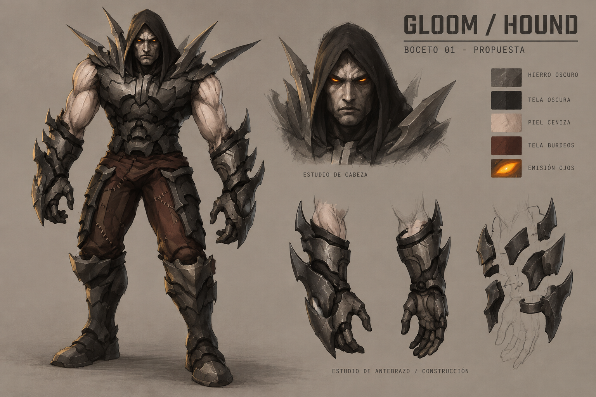

# Gloom — guía artística 0.1

9 de septiembre de 2026 · Hito 78 · **Guía 0.1 y boceto 01 aprobados por el usuario**.
Aceptación registrada en el hito 79, el 10 de septiembre: «asi esta perfecto,
continua con lo siguiente». Se puede avanzar al modelo básico para validarlo;
no se aprueban automáticamente las futuras vistas, el rig ni el acabado final.

## Intención y jerarquía de referencias

Fantasía oscura y tecnología industrial: seres sobrenaturales reconocibles,
armaduras pesadas, armas con formas óseas y fábricas habitadas por energía y lava.
El aspecto debe sentirse hostil y material, con siluetas fáciles de leer en combate.

1. Los concepts originales de Gloom definen identidad, anatomía y motivos.
2. Los assets recuperados definen continuidad con el juego, escala y función.
3. Unreal Tournament 3 orienta peso, volumen y acabado de ciencia ficción industrial.
4. Overwatch 2 aporta un toque de simplificación, planos claros y lectura del color.

Estas influencias son criterios artísticos aceptados, no una proporción matemática
ni una petición de copiar personajes. No sustituir la identidad de Gloom por un
soldado genérico, un perro robótico o un héroe de otro juego.

## Referencias del proyecto

| Referencia | Qué conservar |
| --- | --- |
| [Hound elegido](art/characters/hound-original-concept.jpg) | Humanoide robusto, capucha, piel pálida, ojos naranja, placas afiladas |
| [Archangel original](art/characters/archangel.jpg) | Dorado, cian, silueta dorsal semejante a alas |
| [Shadow original](art/characters/shadow-painting.jpg) | Cuerpo alargado/espectral, coraza de costillas, ojos rojos |
| [Screamer, variante de referencia](art/characters/screamer-original-reference.jpg) | Palidez, corona orgánica y ojos blancos; diseño completo aún sin seleccionar |
| [Armas originales](art/characters/weapons-original-reference.jpg) | Carcasas mecánicas con filos orgánicos y focos de energía |
| [Factory recuperada](../reports/factory-restoration-2026-09-02/README.md) | Metal, piedra, arcos, pasarelas y canales de lava |

La carpeta aportada por el usuario es `D:\Descargas\Gloom` (19 imágenes localizadas).
Solo se incorporan las referencias necesarias; autor original no identificado por
nombre en esta revisión. Conservar firmas y bytes de las copias fuente. Las
adaptaciones generadas se identifican por separado y no se atribuyen al artista.
Las capturas históricas muestran la recuperación de assets, no una nueva captura
de la versión actual del juego.

## Formas y densidad de detalle

- Diseñar de mayor a menor: silueta, grandes masas, articulación y microdetalle.
- Reservar planos tranquilos en pecho, muslos y carcasas para que los bordes se lean.
- Repetir familias de placas solapadas, costillas, cuñas y filos curvos; cada clase
  conserva una silueta distinta. No cubrir todos los personajes con las mismas púas.
- Concentrar detalle en rostro, arma y piezas funcionales; evitar ruido uniforme,
  remaches minúsculos por todas partes y juntas que no expliquen la construcción.
- Separar visualmente brazos del torso y piernas entre sí. Probar cada silueta
  reducida a tamaño de combate; no depender del brillo de los ojos para reconocerla.

## Materiales y color

Paleta inicial para los bocetos. Los códigos son muestras sRGB orientativas,
no valores medidos del original ni constantes aprobadas para shaders.

| Material o acento | Muestra | Tratamiento |
| --- | --- | --- |
| Hierro oscuro | `#35383B` | Reflejo contenido, planos anchos y desgaste en aristas expuestas |
| Tela carbón | `#242327` | Mate, pliegues amplios, contraste suficiente frente al metal |
| Piel ceniza de Hound | `#B7AB98` | Mate y pálida; conservar la lectura ligeramente pétrea de la lámina aprobada, sin convertirlo en gólem |
| Tela granate/tierra | `#50362F` | Cintura y pantalones sobrios, costuras legibles de cerca |
| Ojos de Hound | `#FF801E` | Foco pequeño de energía cálida, sin iluminar toda la armadura |
| Dorado de Archangel | `#A88843` | Metal trabajado, no plástico amarillo |
| Energía de Archangel | `#46CFE0` | Acentos cian que conservan su identidad original |
| Energía de Shadow | `#EF4541` | Acentos rojos localizados, ligados al diseño existente |

El desgaste describe uso: cantos rozados, huecos más oscuros y manchas puntuales.
Metal, tela, piel y cuero deben distinguirse por su respuesta a la luz, incluso
en escala de grises. No hornear la luz naranja de Factory en los mapas de color.
Los colores de clase no reemplazan códigos de equipo, peligro o habilidades.

Para los futuros materiales PBR: separar color, normal, metallic, roughness y
emisión según el contrato del cooker. Hornear nodos procedurales de Blender
cuando el importador no los soporte. No asumir que un material de Blender se
verá igual en Diligent. Empezar con pocos materiales y texturas compartidas;
fijar presupuestos tras medir el asset en Gloom, no por la resolución del boceto.

## Aplicación común al juego

- **Personajes:** identidad propia por proporción, superficie y acento; conservar
  la amenaza de los originales y mejorar la separación de planos.
- **Armas:** mantener silueta y partes funcionales originales. Revisar primero
  encuadre FPS, agarre, cañón y animaciones mecánicas. Los filos no deben ocultar la mira.
- **Factory:** mantener planta, rutas y colisiones. Mejorar lectura de estructuras
  y materiales por zonas; no uniformar todo con óxido ni añadir detalle a cada pared.
- **Recogibles y efectos:** respetar las reglas actuales de disponibilidad, halos,
  colores y habilidades. Bloom y partículas deben conservar la visión del rival.
- **HUD:** conservar iconografía y organización aceptadas. Su rediseño no forma
  parte de esta propuesta de assets.

## Hound — ficha del primer boceto

**Referencia aprobada:** `concept_hound2.jpg`. Hound es bípedo y humanoide.
El nombre y Bite no justifican añadir hocico, patas caninas, cola o locomoción cuadrúpeda.

Rasgos a conservar:

- Capucha oscura que enmarca un rostro humano severo y pálido; ojos anaranjados.
- Hombros anchos, cintura relativamente estrecha y musculatura visible en brazos.
- Coraza por placas, abdomen segmentado, hombreras con filos barridos hacia fuera.
- Guanteletes pesados con filos, cintura de tela oscura rojiza y grebas metálicas.
- Manos que puedan empuñar el arsenal existente; ninguna arma nueva en esta lámina.

Ajustes aceptados en el boceto 01: superficies más ordenadas, separación material
más evidente, desgaste selectivo y pose de pie para leer proporciones. La luz
neutra sustituye el fondo de fuego para juzgar el diseño, no para cambiar su paleta.
Los detalles de manos, cierres y articulaciones que no se ven en la referencia
son interpretaciones; no constituyen un plano de fabricación aprobado.

La lámina ofrece una vista principal y estudios de detalle. No es un turnaround
ortográfico: espalda, perfil, grosores, uniones y recorrido de los filos todavía
deben resolverse en vistas adicionales y un modelo básico.

## Puertas de validación

| Paso | Qué debe pasar antes de continuar |
| --- | --- |
| Boceto 01 — aprobado | Conservar identidad, proporciones, capucha, peso de la armadura y acabado de esta lámina |
| Modelo básico | Frente/perfil/espalda, escala y silueta aprobadas; revisar espacios para las articulaciones |
| Rig de prueba | Caminar, apuntar y Bite sin penetraciones graves ni pérdida de volumen |
| Acabado | UVs, materiales, costuras y detalle revisados con luz neutra y luz de Factory |
| Integración | Cocción, FPS/TPS, anclajes, bounds animados, LODs y coste real comprobados |

El [personaje actual](CHARACTERS.md) usa el cuerpo de Archangel como Hound.
Su rig de 43 huesos y cuatro clips es una posibilidad de reutilización, no una
garantía de encaje. Conservar cámara, cápsula, autoridad y reglas de habilidad.
La escala visual documentada de 1,8 m sirve de referencia inicial, no de nueva
decisión de gameplay. El futuro movimiento debe reflejar un humanoide pesado
pero ágil y respetar la movilidad aceptada del juego.

El boceto ya está aprobado. El [puente Blender–Gloom](BLENDER_WORKFLOW.md) se ha
validado en el hito 79 con una escena pequeña, el cooker y el renderizador Vulkan.
El siguiente entregable es un modelo básico de Hound, no la malla final.

## Próxima revisión: volumen básico de Hound

1. Frente, perfil y espalda: mantener el carácter y las proporciones aprobadas.
2. Comprobar capucha, hombreras, manos y separación de articulaciones en 3D.
3. Revisar escala frente al personaje actual antes de retopología, UVs y rig.

El [informe del hito 78](../reports/art-direction-78/README.md) recoge procedencia,
prompt, revisión y limitaciones. Cada revisión nueva tendrá su propia versión;
la aceptación de una imagen no aprueba automáticamente las siguientes.
