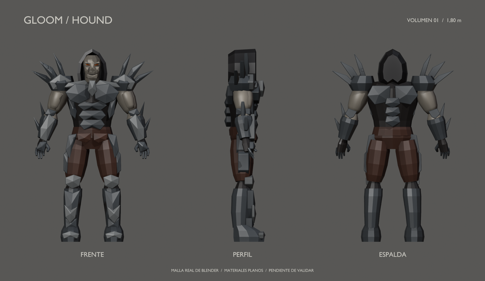

# Hound — volumen básico 01

10 de septiembre de 2026 · Hito 80 · **Pendiente de validación artística**.
La lámina 2D está aprobada; este primer volumen 3D todavía no.

## Entrega

- [Fuente Blender editable](../../../../art/characters/hound/v01/hound-blockout-v01.blend).
- [Tres cuartos](three-quarter.png), [frente](front.png), [perfil](profile.png)
  y [espalda](back.png), renderizados desde la misma geometría.
- [glTF separado](../../../../assets/characters/hound_blockout/v01/hound-blockout.gltf)
  con su BIN vecino. No sustituye el Hound jugable.

La lámina de vistas es un render de tres copias enlazadas de la malla, no un
paintover ni una imagen generada que prometa geometría inexistente. La fuente
contiene la colección `HOUND_v01_MODEL_ONLY` y cuatro cámaras ortográficas.
Las piezas tienen nombres por región y lado para poder ajustar proporciones.

## Qué representa

Altura de **1,80 m**, igual a la malla de Archangel que usa actualmente Hound.
Dimensiones completas: aproximadamente 1,144 m de ancho con filos y 0,382 m
de fondo. 105 piezas editables, 6.974 triángulos al evaluar modificadores y
7 materiales de color plano. Metros, suelo en Z = 0 y frente hacia -Y en Blender;
el glTF se exporta con Y arriba y frente +Z.

Se conservan capucha, ojos naranja, torso ancho, cintura estrecha, brazos
descubiertos, placas de pecho/abdomen, hombreras afiladas, guanteletes, pantalón
granate y grebas. La espalda se resuelve provisionalmente con dos placas
escapulares y una columna corta, sin capa ni alas.

Las superficies facetadas son una simplificación de trabajo, **no una decisión
de convertir el juego en low-poly**. Rostro, manos, anatomía, filos y pliegues son
formas de posición y volumen, no un acabado aceptado. Los colores separan
materiales; no sustituyen la textura y el tratamiento de piel del boceto.

## Qué revisar ahora

1. Proporción entre cabeza/capucha, pecho, brazos, manos y piernas.
2. Amplitud y altura de hombreras, filos y guanteletes en la silueta.
3. Espalda propuesta y espacio aparente en hombros, codos, rodillas y cadera.

No hay rig, UVs de producción, texturas finales ni animaciones. Las articulaciones
no han pasado pruebas de deformación y no se afirma ausencia de penetraciones.
Las 105 piezas generan 105 batches en el visor: se prioriza edición, no rendimiento
de producción. Habrá que reorganizar la malla y sus materiales tras aprobarla.
No se cambian cápsula, hitboxes, cámara, movilidad ni las reglas del personaje.

## Procedencia y reconstrucción

Modelado procedural local en Blender a partir del [boceto aprobado](../hound-concept-v01.png)
y la [guía artística](../../../DIRECCION_ARTISTICA.md). La referencia primaria
sigue siendo el concept original de Gloom; no se altera ni se atribuye esta
nueva malla a su artista original. Sin llamadas a generadores 3D externos.

Scripts en `tools/art/`: `build_hound_blockout.py` crea la geometría en una
escena nueva; `review_hound_blockout.py` guarda fuente, vistas y exportación;
`turnaround_hound_blockout.py` produce la lámina de tres vistas.
El constructor se niega a sobrescribir una escena Hound v01 existente.
El script de revisión guarda/exporta las rutas v01: para una revisión futura
conservar esta versión y preparar nuevas rutas antes de ejecutarlo.

Verificación e incidencias en el [informe 80](../../../../reports/hound-blockout-80/README.md).
