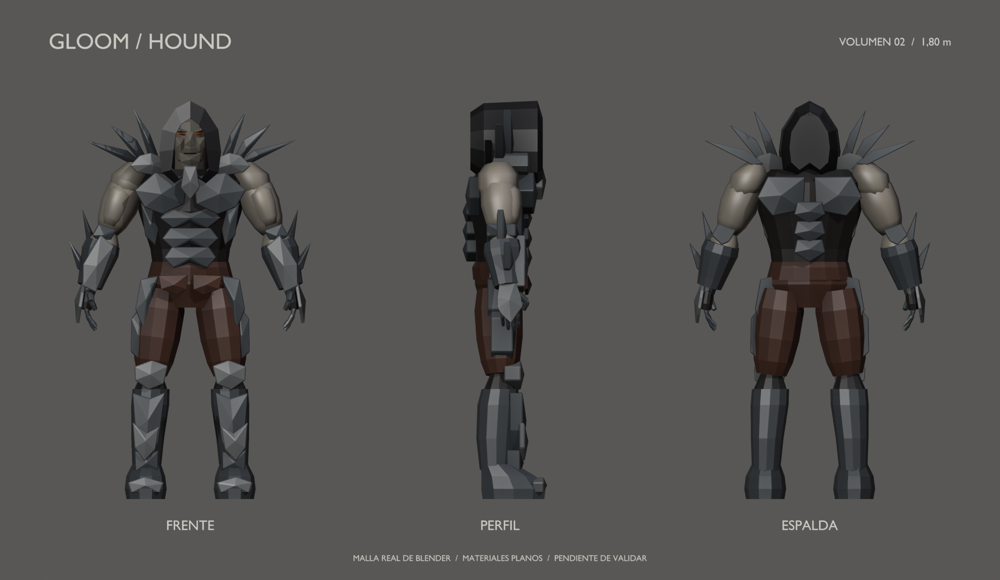
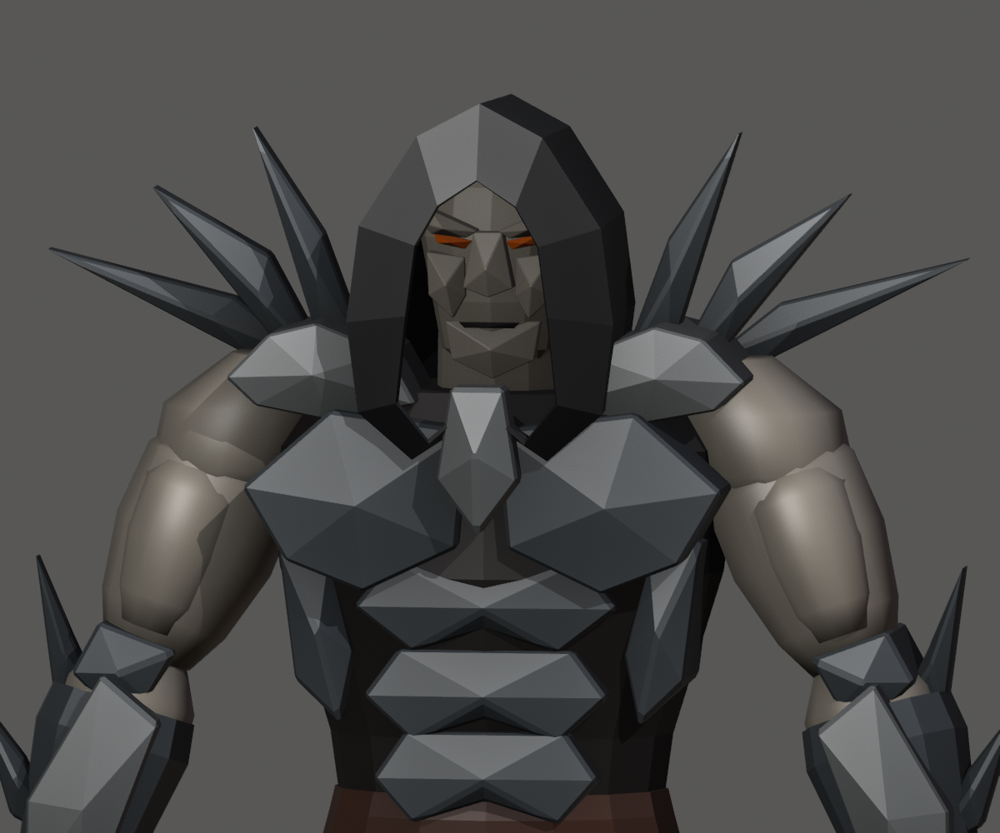
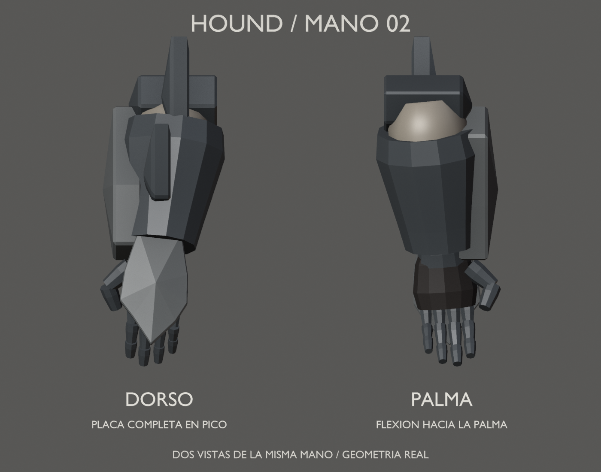

# Hound — volumen básico 02

10 de septiembre de 2026 · Hito 81 · **Diseño aprobado por el usuario en el hito 82**.
Aceptación: «apruebo el diseño». Corrige la versión 01 según sus comentarios;
la aprobación corresponde a silueta y volúmenes, no al acabado final ni al rig.

## Cambios solicitados

- **Hombros:** retiradas las copas que envolvían el hombro. El deltoides queda
  descubierto y los filos se apoyan en una coraza más medial, sobre clavícula/cuello.
- **Capucha:** borde adelantado y abertura interior más baja/estrecha, que
  cubre más frente y laterales sin cambiar la altura del personaje.
- **Manos:** palmas hacia los muslos, pulgares hacia delante y dedos que se
  curvan hacia la palma. Placa dorsal completa desde la muñeca hasta los
  nudillos, prolongada en pico; dedos separados y pulgar libres para un futuro agarre.

La lámina de mano muestra dos copias giradas de la misma geometría izquierda;
no son dos diseños distintos. Los dedos articulados son geometría estática,
no un rig validado. Falta comprobar deformación, contactos y agarres reales.

## Archivos

- [Fuente Blender v02](../../../../art/characters/hound/v02/hound-blockout-v02.blend).
- [Tres cuartos](three-quarter.png), [frente](front.png), [perfil](profile.png) y [espalda](back.png).
- [Exportación glTF](../../../../assets/characters/hound_blockout/v02/hound-blockout.gltf), junto a su BIN.
- [Versión 01 conservada](../blockout-v01/README.md).

La escena activa es `Hound_Blockout_v02`, con la colección `HOUND_v02_MODEL_ONLY`
y cuatro cámaras de revisión. El archivo conserva también la escena v01 como
referencia; la exportación selecciona únicamente v02. Geometría y materiales
de v02 son independientes para no alterar esa referencia al editar.

113 piezas editables, 7.626 triángulos evaluados y 7 materiales planos. Altura
1,80 m, ancho total 1,092 m y fondo 0,382 m. Los materiales, el rostro facetado
y la anatomía siguen siendo provisionales. No hay UVs/texturas finales ni rig.

Se han comprobado las tres correcciones y la conservación de 67 piezas del
cuerpo, la apertura del .blend, la exportación y la carga en Gloom. No se ha
reemplazado el Hound jugable. 113 batches son un coste de la organización
editable, no un presupuesto de producción.

## Reconstrucción

Conservar esta v02 como referencia aprobada. El siguiente paso es preparar la
malla y un rig de prueba en una nueva versión, manteniendo las formas aceptadas.
Validar caminar, apuntar y Bite, deformaciones y agarres antes del acabado final.
Ver [registro de aprobación](../../../../reports/hound-approval-82/README.md).

Abrir la fuente v01 en Blender y ejecutar `tools/art/revise_hound_blockout_v02.py`
mediante MCP. El script crea una escena nueva y se niega a sobrescribir v02.
Con la escena v02 activa, `review_hound_blockout.py` guarda fuente, cuatro vistas
y exportación; `turnaround_hound_blockout.py` crea la lámina general y
`detail_hound_blockout_v02.py` produce los primeros planos.

Los scripts de revisión escriben las rutas de la versión activa. Para otra
revisión, conservar v02 y preparar nuevas rutas antes de guardar/exportar.
Todas las imágenes provienen del modelo real, sin generación 2D ni paintover.

Ver [informe y comprobaciones del hito 81](../../../../reports/hound-blockout-81/README.md).
