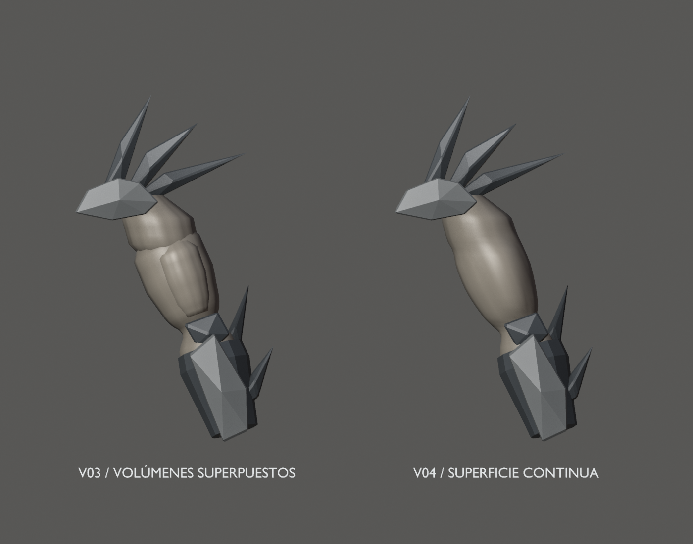

# Hound v04 — continuidad de hombros y brazos

10 de septiembre de 2026 · Hito 84. Pase de topología, no malla definitiva.
Mantiene el diseño [v02 aprobado](../blockout-v02/README.md) y el esqueleto
de prueba de [v03](../rig-v03/README.md), sin añadir controles o animaciones finales.

Los volúmenes separados de deltoides, bíceps y brazo se sustituyen por una
superficie continua desde el hombro hasta la muñeca. Cada brazo tiene 37 anillos
de 32 vértices y 1.152 quads laterales, más dos cierres. Se conserva la envolvente
anterior con suavizado local de las intersecciones: desviación máxima de los
vértices nuevos hacia las superficies de referencia de 2,763 mm.
Esta medida no es una comparación bidireccional de toda la superficie.

103 componentes restantes conservan sus vértices, incluidos capucha, clavículas,
guanteletes, manos y piernas. Las 93 piezas rígidas conservan su vínculo a un
hueso. Los 53 huesos mantienen posición de reposo, ejes, longitudes y jerarquía.
Solo se reasignan pesos provisionales en los brazos nuevos para comprobarlos.

## Fuente y revisión

- [Fuente Blender v04](../../../../art/characters/hound/v04/hound-mesh-v04.blend).
- [Vídeo de articulaciones](joint-check.mp4), [reposo](rest.png), [frente](front.png),
  [codos](elbows.png) y [brazos levantados](reach.png).
- [glTF con skin y clip diagnóstico](../../../../assets/characters/hound_rig/v04/hound-rig.gltf), junto a su BIN.
- [Informe y pruebas](../../../../reports/hound-mesh-84/README.md).

Una malla, siete materiales/primitivas, 8.941 vértices de autoría y 17.466
triángulos. Son 336 triángulos más que v03. Los grupos `PART_Arm_surface_L/R`
seleccionan las nuevas superficies; los demás grupos `PART_` se conservan.
Escena activa `Hound_Mesh_v04`, rig `Hound04_Rig`, malla `H04_DeformMesh`.
Las escenas previas permanecen como referencia y no entran en el glTF.

El clip `Hound04_joint_check` es la misma prueba FK de 6 s, no caminar ni Bite.
Las vistas comparativas son renders de la geometría real con igual iluminación,
sin sombras proyectadas para leer las uniones; no son un paintover.

## Pendiente antes del rig definitivo

Revisar anatomía y conexiones de manos/dedos, cintura/ropa, rostro y contactos
de la armadura durante agarres reales. Este pase elimina los solapes de los
volúmenes del brazo, no todas las uniones del personaje. No se ha completado
la retopología global ni realizado UVs, texturas, pesos finos, retargeting,
locomoción/Bite final o sustitución del Hound jugable.

Conservar v02, v03 y v04. La siguiente revisión de malla debe usar otra versión;
seguir usando el rig actual solo como comprobación hasta estabilizar topología.
