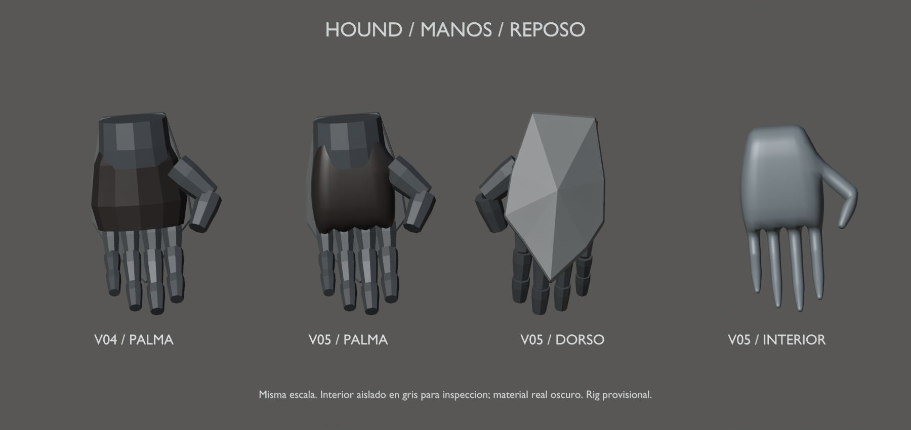

# Hound v05 — continuidad interior de manos

12 de septiembre de 2026 · Hito 85. Pase de topología, no malla ni rig definitivos.
Conserva el [diseño v02 aprobado](../blockout-v02/README.md) y los brazos de
[v04](../mesh-v04/README.md). No cambia la placa dorsal completa en pico.

## Qué cambia

Cada mano tiene ahora una superficie interior continua: palma, unión del pulgar
y cuatro dedos. Sustituye la palma aislada; no elimina las falanges metálicas.
Una jaula de quads con cinco ramificaciones se subdivide una vez y se integra
en la malla. Se deja margen bajo el metal y se corrige el giro de las secciones
del pulgar para evitar un estrechamiento artificial en su articulación.

Solo se reemplazan `PART_Palm_L/R` por `PART_Hand_glove_L/R`. Los otros 103
componentes conservan vértices, caras, materiales y pesos, incluidas las 93
piezas rígidas. Los 53 huesos y las claves del clip diagnóstico no cambian.
Cada guante tiene 1.090 vértices y 1.088 quads; es un único componente cerrado.

La malla completa tiene 10.401 vértices y 20.386 triángulos (+2.920 frente a v04),
un skin y siete materiales/primitivas. Los pesos del interior son provisionales,
con hasta dos influencias; el presupuesto y los LODs finales siguen pendientes.

## Fuente y revisión

- [Fuente Blender v05](../../../../art/characters/hound/v05/hound-mesh-v05.blend).
- [glTF de prueba](../../../../assets/characters/hound_rig/v05/hound-rig.gltf), junto a su BIN.
- [Manos en flexión](hand-flexion.png), [cuerpo en reposo](rest.png) y [pose de dedos](fingers.png).
- [Vídeo diagnóstico de articulaciones](joint-check.mp4).
- [Informe y pruebas](../../../../reports/hound-mesh-85/README.md).

Escena activa `Hound_Mesh_v05`, malla `H05_DeformMesh`, rig `Hound05_Rig`.
Las escenas previas y las dos láminas de manos quedan en la fuente, fuera de
la exportación. El clip `Hound05_joint_check` conserva la prueba FK de 6 s.

Las láminas comparan la misma mano izquierda, escala y luz, en reposo y
flexión. Se aísla el interior en gris **solo para inspección**: su material real
es oscuro. Son renders de la geometría, sin paintover. El clip flexiona los
cuatro dedos; los pulgares se comprueban en cuatro casos aparte, sin nuevas claves.

## Límites y siguiente pase

No es el acabado final de las manos: el metal sigue siendo el volumen básico
aprobado y quedan contactos, agarres reales, anatomía y reducción de densidad.
Las pruebas comprueban continuidad y estabilidad numérica, no ausencia exhaustiva
de intersecciones ni capacidad de sujetar cualquier arma. El visor Gloom se ha
comprobado en reposo; la reimportación de poses se ha comprobado en Blender.

Continuar cintura/ropa y rostro en otra versión. Mantener el rig como herramienta
de prueba hasta estabilizar la malla, antes de pesos finos, controles y animaciones
de producción. Sin UVs/texturas finales, retargeting ni sustitución del Hound jugable.
