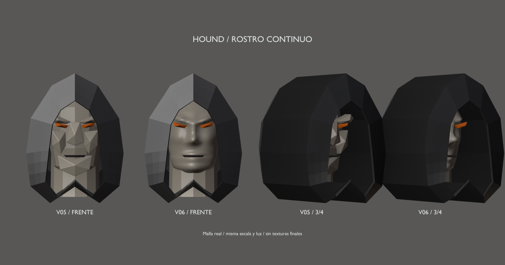
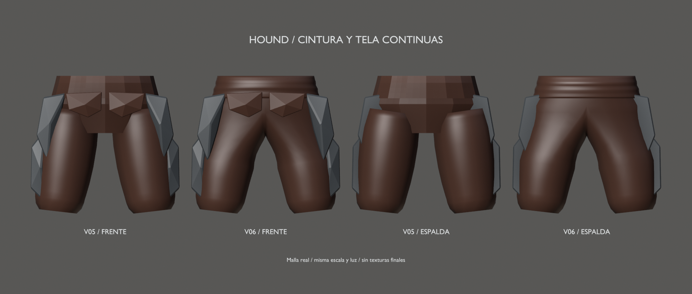

# Hound v06 — cintura, ropa y rostro

12–14 de septiembre de 2026 · Hito 86. Pase de malla, no acabado ni rig definitivos.
Conserva la silueta del [diseño v02 aprobado](../blockout-v02/README.md), los
brazos v04 y las manos de [v05](../mesh-v05/README.md).

## Cambios

- **Pantalones:** cadera, entrepierna y ambas piernas forman una sola superficie
  cerrada. Desaparecen las tapas superpuestas de pelvis y muslos. Se mantiene
  la transición de tela burdeos a tejido interior oscuro bajo las grebas.
- **Faja:** envoltura hueca de 3 mm, con pliegues suaves; sigue siendo una pieza
  de tela independiente. Los faldones frontales y protectores no cambian.
- **Rostro:** cabeza, mandíbula, nariz, mejillas y cejas pasan de siete bloques
  superpuestos a una superficie neutra. Capucha, ojos y marca de boca se conservan.

Se reemplazan once componentes y se conservan los otros 94: vértices, caras,
materiales y pesos comprobados. Ninguna placa de armadura se elimina. Los 53
huesos y las claves del clip diagnóstico son los mismos; solo se pesan las
superficies nuevas. La cabeza entera sigue vinculada al hueso Head.

Una malla/skin, siete materiales/primitivas, 13.752 vértices y 27.124 triángulos
de autoría (+6.738 frente a v05), con hasta dos influencias por vértice.
No es el presupuesto final: habrá que reducir densidad y comprobar LODs y coste.

## Archivos y revisión

- [Fuente Blender v06](../../../../art/characters/hound/v06/hound-mesh-v06.blend).
- [glTF de prueba](../../../../assets/characters/hound_rig/v06/hound-rig.gltf), junto a su BIN.
- [Reposo](rest.png), [espalda](back.png), [paso diagnóstico](step.png) y [giro de torso](torso.png).
- [Vídeo de articulaciones](joint-check.mp4), mismo clip diagnóstico de 6 s.
- [Informe y validación](../../../../reports/hound-mesh-86/README.md).

Escena `Hound_Mesh_v06`, malla `H06_DeformMesh` y rig `Hound06_Rig`.
Grupos nuevos `PART_Trousers_continuous`, `PART_Waist_wrap` y `PART_Head_surface`.
Las escenas anteriores y las láminas comparativas quedan en la fuente, fuera
del glTF. Las comparaciones son renders de la malla real, a igual escala y luz,
sin paintover; la de cintura recorta por encima de las rodillas solo para revisión.

## Lo que no se cierra

El rostro sigue siendo un primer pase anatómico, con anillos de superficie,
no bucles faciales definitivos alrededor de ojos y boca. No tiene apertura de
mandíbula, cavidad bucal, expresiones o rig facial. Los ojos/boca conservan sus
formas provisionales; el acabado requiere otra revisión artística.

La ropa usa skinning, no simulación. Se han comprobado continuidad y estabilidad
numérica, además de revisar poses de esfuerzo; no se certifica ausencia de
penetraciones ni calidad de agarres. El visor Gloom se comprueba en reposo;
las poses exportadas se reimportan y comparan en Blender, no dentro del juego.

Continuar capucha/cuello y contactos de placas en otra versión, conservando v02–v06.
Después abordar agarres, anatomía/acabado y topología facial específica. El rig
seguirá siendo de prueba hasta estabilizar la malla. Sin UVs/texturas finales,
retargeting, caminar/Bite de producción o sustitución del Hound jugable.
