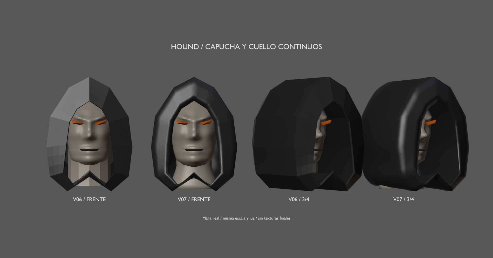
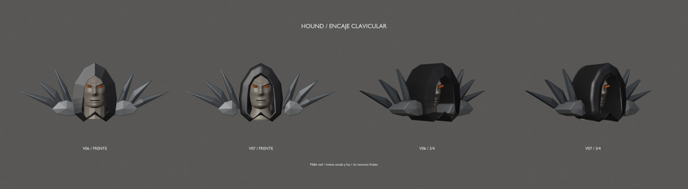

# Hound v07 — capucha, cuello y encaje clavicular

14 de septiembre de 2026 · Hito 87. Pase de malla con rig diagnóstico,
no acabado definitivo ni nueva aprobación artística. Conserva las fuentes
[v02 aprobada](../blockout-v02/README.md) y [v06](../mesh-v06/README.md).

## Cambios

- **Capucha:** exterior, borde y forro interior forman una superficie cerrada
  y conexa, sin el labio superpuesto. La abertura y el contorno frontal conservan
  exactamente las polilíneas aprobadas, subdivididas; no se descubre más la cara
  en reposo. Se suaviza el volumen posterior y se recoge el lateral bajo junto
  a los filos interiores. El sombreado suave no es una textura o material final.
- **Cuello:** diez secciones con transiciones y relieves suaves, en lugar del
  volumen cilíndrico facetado. Sigue siendo una pieza separada de cabeza y torso.
- **Clavículas:** se comprime solo el extremo medial de las dos bases, antes
  oculto dentro de la capucha. Se conservan sus extremos exteriores, las otras
  coordenadas y pesos, y los seis filos completos. Los hombros siguen libres.

Se reemplazan tres componentes por dos y se ajustan esas dos bases; los otros
92 conservan vértices, caras, materiales y pesos. Rostro, ojos, boca provisional,
brazos, manos y resto de armadura no cambian. Los 53 huesos y las claves del
clip son los mismos. La capucha nueva mezcla torso/cabeza; el cuello mezcla
torso/cuello/cabeza por zonas, nunca más de dos influencias por vértice.

Una malla/skin, siete materiales/primitivas, **14.026 vértices y 27.672 triángulos**
de autoría: +548 triángulos, aproximadamente un 2 %. No es el presupuesto final.
Se mantienen 87 componentes rígidos y quedan 96 componentes en total.

## Archivos y revisión

- [Fuente Blender v07](../../../../art/characters/hound/v07/hound-mesh-v07.blend).
- [glTF de prueba](../../../../assets/characters/hound_rig/v07/hound-rig.gltf), junto a su BIN.
- [Reposo](rest.png), [espalda](back.png), [paso diagnóstico](step.png) y [giro de torso](torso.png).
- [Vídeo diagnóstico](joint-check.mp4), 6 s, no caminar ni ataque finales.
- [Informe, comprobaciones y reproducción](../../../../reports/hound-mesh-87/README.md).

Escena `Hound_Mesh_v07`, malla `H07_DeformMesh`, rig `Hound07_Rig` y acción
`Hound07_joint_check`. Grupos `PART_Hood_continuous` y `PART_Neck_surface`;
`LANDMARK_Hood_opening`/`LANDMARK_Hood_outer_front` identifican los puntos
conservados. Las láminas son renders reales, sin paintover. Las escenas previas
y las comparaciones se conservan en el Blend, pero no se exportan al glTF.

## Qué se ha comprobado y qué falta

Superficies nuevas cerradas, conexas, orientadas y sin cruces detectados entre
caras no adyacentes en reposo; abertura exacta, pesos y deformación en 61 muestras.
Las bases claviculares pasan de 40 pares de caras intersectadas cada una a cero.
Cuatro pruebas extra: cabeza ±35° de giro y cuello/cabeza ±10°/±20° de inclinación.
No se detectan cruces capucha/clavículas ni autointersecciones no adyacentes
de la capucha en esos cuatro casos tras ajustar sus pesos provisionales.

La reimportación glTF concuerda en 13 poses; el visor Gloom solo se comprueba
en reposo. Esto no valida el clip dentro del juego, todos los contactos del
cuerpo, separación mínima entre superficies, comportamiento físico de la tela,
anatomía, agarres ni calidad final de animación.

Siguiente pase: contactos del conjunto y agarres reales, antes de afinar el
rig. Después anatomía/acabado y topología facial específica. Conservar v02–v07;
sin UVs/texturas finales, retargeting ni sustitución del personaje jugable.
