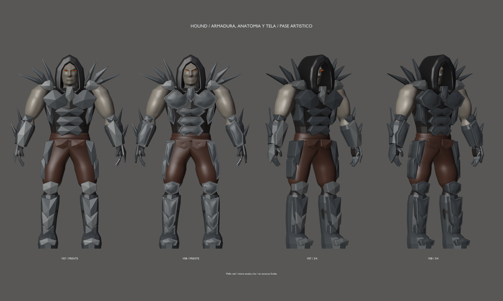
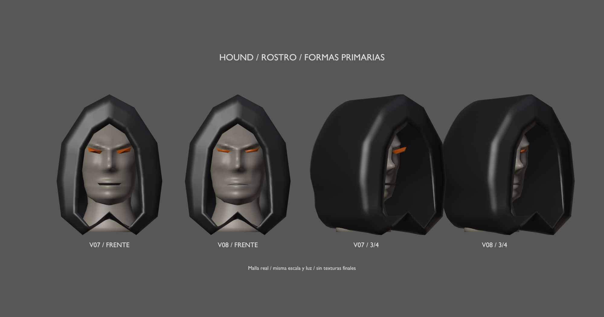

# Hound v08 — primer pase artístico global

15–16 de septiembre de 2026 · Hito 89. **Propuesta para revisión: la escultura
no está terminada.** Se conservan la [v02 aprobada](../blockout-v02/README.md)
y la [v07](../mesh-v07/README.md), sin cambiar sus archivos.

## Qué cambia

- **Armadura:** campos curvos y bordes estrechos sustituyen las caras piramidales
  de 33 placas de pecho, espalda, abdomen, brazos, manos y piernas. Se reutilizan
  los contornos y espesores del diseño v02; las caras interiores siguen siendo
  una base de construcción, no un estudio final de ensamblaje.
- **Brazos:** primer relieve de bíceps, tríceps y deltoides, con transiciones
  contenidas; desplazamiento máximo de unos 8 mm, sin cambiar pesos o topología.
- **Rostro:** mejillas, órbitas, entrecejo y mandíbula más definidos. Ojos y
  línea de labios ajustados a la superficie, sin las cuñas salientes anteriores.
  La boca sigue cerrada y la cabeza no tiene rig facial.
- **Tela:** pliegues amplios en pantalones/faja y dos paños reconstruidos sin
  la cresta piramidal rígida. No hay simulación, costuras ni detalle de tejido.

Se reconstruyen 38 componentes, se esculpe el relieve de cinco superficies
conservando su topología y se preservan exactamente otros 53 componentes.
Capucha, cuello, bases claviculares y filos conservan la geometría/pesos de v07.
Las manos mantienen palmas hacia dentro y placa dorsal completa acabada en pico;
se refina esa placa, sin modificar dedos ni guante interior.

20.130 vértices y 39.880 triángulos de autoría, 96 componentes y 87 rígidos.
Un mesh/skin, siete materiales y los mismos 53 huesos/clip de prueba; máximo
dos influencias. +12.208 triángulos respecto a v07: habrá que revisar densidad
y LODs antes de fijar el presupuesto de producción.

## Archivos

- [Fuente Blender](../../../../art/characters/hound/v08/hound-mesh-v08.blend).
- [Exportación glTF](../../../../assets/characters/hound_rig/v08/hound-rig.gltf), junto a su BIN.
- [Reposo](rest.png), [espalda](back.png), [paso de prueba](step.png) y [giro de torso](torso.png).
- [Vídeo de articulaciones](joint-check.mp4).
- [Informe técnico y reproducción](../../../../reports/hound-art-89/README.md).

Escena `Hound_Mesh_v08`, malla `H08_DeformMesh`, rig `Hound08_Rig` y clip
`Hound08_joint_check`. Las comparativas son renders reales a igual escala,
cámara y luz, sin paintover ni texturas nuevas. El sombreado de revisión
no representa la respuesta material final dentro del juego.

## Qué falta antes de cerrar la escultura

Revisar esta evolución contra el boceto aprobado. Quedan remates en las
carcasas de guanteletes/grebas, botas, dedos y articulaciones; construcción
de uniones y ropa; y un pase facial más específico. No se ha hecho microdetalle
ni retopología facial de producción. La v08 no está aprobada automáticamente.

Las pruebas comprueban topología, conservación y estabilidad de deformación;
no certifican anatomía, contactos globales, agarres o animaciones finales.
El glTF se compara en Blender y el visor del motor se revisa en reposo:
no se ha validado la reproducción del clip dentro del juego.

Mantener el rig diagnóstico mientras se completa y valida el modelado.
Después abordar pesos/controles definitivos, UVs/materiales, retargeting e
integración jugable en sus fases correspondientes.
