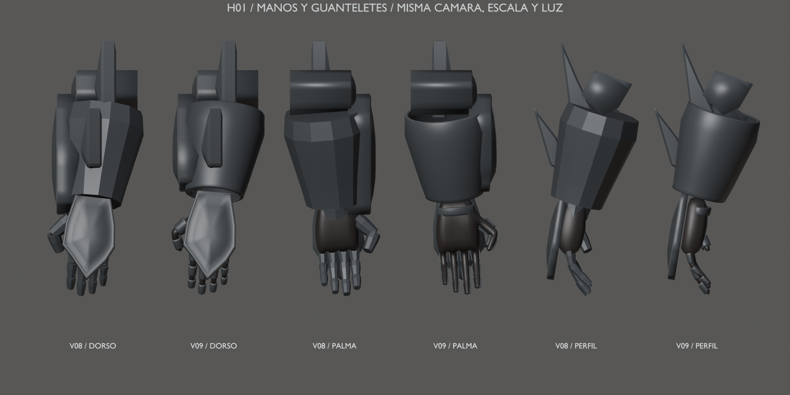
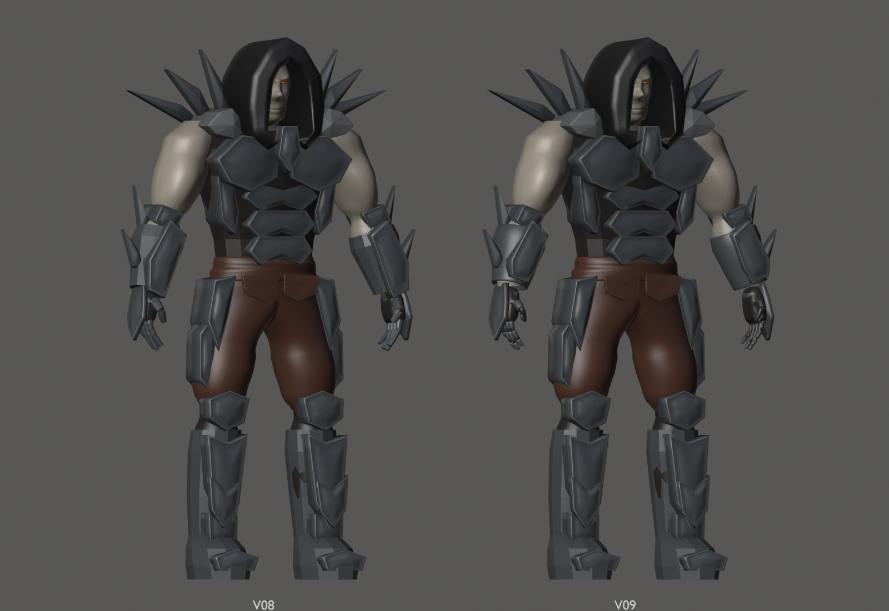

# Hound v09 — H01, manos y guanteletes

16 de septiembre de 2026 · Hito 91. **Pase local de H01; la escultura global
sigue abierta para H05.** Entrada: v08 del hito 89 (`68e686e`).
Las versiones anteriores se conservan.

## Construcción y articulación

Carcasas de antebrazo huecas con pared nominal de 7 mm, aros de muñeca de
4 mm y falanges dorsales de 2,2 mm abiertas por la palma. Los extremos de
las falanges dejan libres las articulaciones y el pulgar mantiene su orientación.
El borde distal de la carcasa y el extremo de la placa frontal liberan la muñeca.
Se ajustan el apoyo tenar, la concavidad palmar y el volumen del guante bajo la placa.

Se conserva **exactamente** la placa dorsal completa acabada en pico, además
de los filos de antebrazo, las piezas del codo y todo el resto del cuerpo.
32 componentes reconstruidos, cuatro ajustados conservando caras/pesos y
60 componentes exactos. No es solo un cambio de sombreado.

- [Mano abierta](open.png), [puño](fist.png), [flexión de muñeca +25°](flex.png) y [extensión −25°](extend.png).
- [Vídeo de articulación](hand-check.mp4): 151 frames, 800×1000, 30 fps, 5,03 s.
- [Frontal](front.png), [perfil](profile.png), [espalda](back.png) y [tres cuartos](rest.png).

## Prueba con Soul Reaper y límite para H08

Se usa la geometría original de `assets/characters/original/soul_reaper.gltf`
con su escala importada y el factor de presentación 0,43 del juego.
El ensayo es un **apoyo de dedos/pinza contra la carcasa posterior**:
[detalle lateral](grip.png), [oblicuo](grip-oblique.png), [arma completa](grip-context.png).

No es una empuñadura cerrada ni un socket aceptado para jugar. El anclaje inicial
basado en el socket actual atravesaba los dedos; se descarta para esta mano.
El apoyo alternativo no tiene cruces detectados en la pose mostrada, con distancia
mínima muestreada vértice-superficie de 0,558 mm. Queda espacio entre palma y
carcasa: H08 debe resolver el cierre palmar, oposición del pulgar, apoyo izquierdo
y anclaje a la pose de apuntado. El arma no se modifica ni se exporta con Hound.

## Archivos y validación

- [Fuente Blender](../../../../art/characters/hound/v09/hound-mesh-v09.blend).
- [glTF](../../../../assets/characters/hound_rig/v09/hound-rig.gltf) y [BIN](../../../../assets/characters/hound_rig/v09/hound-rig.bin).
- [Informe técnico, límites y reproducción](../../../../reports/hound-hands-91/README.md).

Escena `Hound_Mesh_v09`, malla `H09_DeformMesh`, rig `Hound09_Rig`,
acción `Hound09_joint_check`, colección `HOUND_v09_EXPORT`.
23.522 vértices, 46.680 triángulos, 96 componentes, siete materiales y
87 piezas rígidas. Se conservan los 53 huesos, bind pose, claves y máximo de
dos influencias. El vídeo adicional usa una acción temporal que no se guarda
en la fuente ni en el glTF.

Fuente reabierta: topología, pesos, conservación y 61 muestras diagnósticas pasan.
Cinco poses adicionales en ambas manos: 121 pares locales por mano/pose sin
cruces, ni autointersecciones no adyacentes de los guantes. Roundtrip en 13 poses:
error máximo 0,000002036 m. Regresión v08, cooker, visor estático Vulkan 7/7
y tres pruebas CTest pasan. No se certifican contactos globales ni animación
en el motor. Sin UVs/texturas finales, rig definitivo o cambios de gameplay.

Siguiente entrada acumulada: esta v09. **H02 no se ha iniciado.**
