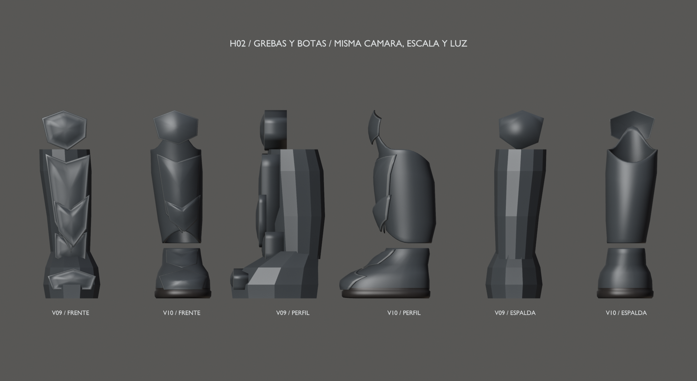
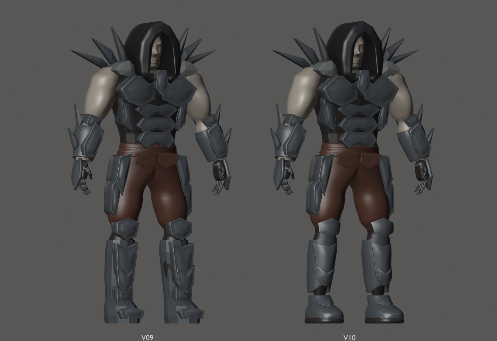

# Hound v10 — H02, grebas, rodillas y botas

17 de septiembre de 2026 · Hito 92. Solo H02. La escultura global sigue abierta
para H05. Entrada: v09 del hito 91 (`8bc8060`), conservada sin cambios.

## Construcción y apoyos

Grebas huecas de pared radial nominal de 6 mm, borde posterior aliviado y
lengüeta frontal integrada que sostiene la rodillera. Las placas de rodilla,
espinilla, tobillo y puntera envuelven su soporte con espesor de 4 mm en Y.
Botas cerradas con suela biselada, ligera elevación de la punta y cavidad
interior en el tobillo. El forro se ajusta solo por debajo de Z=0,61 m.

Se reconstruyen 14 piezas y se ajusta el tramo inferior del pantalón.
Los otros 81 componentes, incluidas ambas manos completas, permanecen exactos.
Se conservan los contornos laterales de las placas, la anchura de la pierna,
el apoyo de referencia en Z=0 y todos los huesos y pesos.

- Conjunto: [frontal](front.png), [perfil](profile.png), [espalda](back.png) y [tres cuartos](rest.png).
- Detalles: [rodilla](detail-knee.png), [tobillo](detail-ankle.png) y [planta](detail-sole.png).
- Apoyos: [reposo](pose-rest.png), [rodilla a 70°](pose-knee.png), [paso](pose-step.png),
  [punta](pose-toe.png) y [talón](pose-heel.png).
- [Vídeo diagnóstico](leg-check.mp4): 181 frames, 900×1100, 30 fps, 6,033 s.

Las vistas aisladas de detalle omiten el pantalón para mostrar espesores y
cavidades; las vistas de apoyo incluyen el forro. La traslación vertical de
los apoyos solo pertenece a las poses de revisión. El clip fuente no cambia.

## Archivos y validación

- [Fuente Blender](../../../../art/characters/hound/v10/hound-mesh-v10.blend).
- [glTF](../../../../assets/characters/hound_rig/v10/hound-rig.gltf) y [BIN](../../../../assets/characters/hound_rig/v10/hound-rig.bin).
- [Informe, límites y reproducción](../../../../reports/hound-legs-92/README.md).

Escena `Hound_Mesh_v10`, malla `H10_DeformMesh`, rig `Hound10_Rig`,
acción `Hound10_joint_check`, colección `HOUND_v10_EXPORT`.
27.958 vértices, 55.560 triángulos, 96 componentes, siete materiales,
87 piezas rígidas y 53 huesos. Son cifras de autoría; H06/H07 fijarán presupuesto y LODs.

Fuente final reabierta: topología, conservación, pesos y 61 muestras del clip pasan.
17 poses adicionales: 1.785 pares locales sin cruces y plantas sin inversión;
tampoco hay autointersecciones no adyacentes del pantalón en esas poses.
Roundtrip glTF en 13 poses: error máximo 0,000002069 m.
Cooker/visor estático Vulkan 7/7 y tres pruebas CTest pasan.

La cobertura llega a 70° de rodilla en el caso descrito en el informe.
No certifica flexión profunda, torsión lateral, marcha final ni colisión continua
o global. H11 resolverá marcha y deslizamiento; H08, el rig definitivo.
La aceptación artística global sigue reservada a H05.

Siguiente entrada acumulada: esta v10. **H03 no se ha iniciado.**
