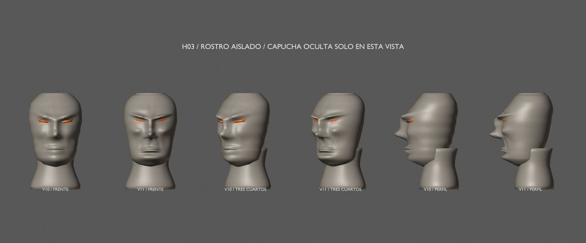
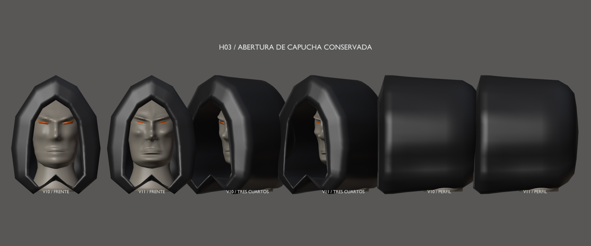
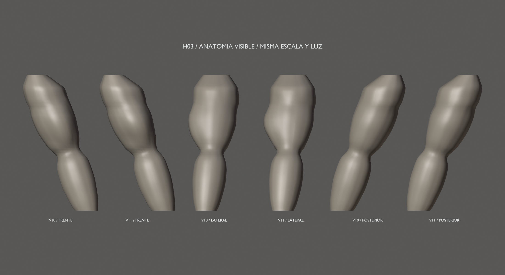

# Hound v11 — H03, rostro y anatomía visible

17 de septiembre de 2026 · Hito 93. Solo H03. Entrada v10 del hito 92
(`6c2fe7f`), conservada. Propuesta artística; aprobación global pendiente de H05.

Órbitas y párpados, pómulos, nariz humana, labios comprimidos y mentón más plano.
Ojos en almendra ajustados a la cara; capucha, cuello y clavículas exactos.
Sin rig facial, apertura de mandíbula, rasgos caninos ni microdetalle.

Deltoides, bíceps, tríceps y antebrazo integrados en las superficies continuas.
Cuatro componentes reconstruidos, dos ajustados y 90 exactos, incluidas las
manos H01 y piernas H02. Huesos y pesos diagnósticos conservados.

- Conjunto: [frontal](front.png), [perfil](profile.png), [espalda](back.png) y [tres cuartos](rest.png).
- Tamaño de combate: [432 píxeles de altura](combat-size.png) y [288 píxeles](combat-far.png), sin emisión ni bloom.
- Cabeza: [giro izquierdo](pose-turn-left.png), [giro derecho](pose-turn-right.png),
  [arriba](pose-look-up.png) y [abajo](pose-look-down.png).
- Brazos: [reposo](pose-rest.png), [codo a 85°](pose-elbow.png) y [alcance](pose-reach.png).
- [Vídeo diagnóstico de cabeza y brazos](anatomy-check.mp4): 241 frames, 30 fps, 8,033 s.

Los ojos se leen como un acento pequeño y tenue a distancia; la vista de 288 px
muestra su límite. Workbench no usa la emisión del material. No es una captura
de combate real ni una aprobación de materiales de producción.

## Fuente y validación

- [Fuente Blender](../../../../art/characters/hound/v11/hound-mesh-v11.blend).
- [glTF](../../../../assets/characters/hound_rig/v11/hound-rig.gltf) y [BIN](../../../../assets/characters/hound_rig/v11/hound-rig.bin).
- [Informe, ángulos, contactos y reproducción](../../../../reports/hound-anatomy-93/README.md).

Escena `Hound_Mesh_v11`, malla `H11_DeformMesh`, rig `Hound11_Rig`,
acción `Hound11_joint_check`, colección `HOUND_v11_EXPORT`.
35.490 vértices, 70.624 triángulos (+27,1 %), siete materiales y 53 huesos.
Densidad de autoría; H06/H07 fijarán presupuesto y malla de producción.

Fuente reabierta, geometría/pesos y 61 muestras del clip comprobados.
25 poses locales; cara/ojos/boca sin cruces con capucha en 100 evaluaciones.
Los brazos conservan al menos el 96,825 % del volumen. El rig heredado pinza
en flexión profunda y alcance máximo: H03 no incrementa esos cruces.
Cabeza/cuello y capucha/cuello conservan ensamblajes con superficies solapadas;
no se certifica colisión global. Los pares y límites están en el informe.

Roundtrip en 13 poses: máximo 0,000002069 m; regresión v10 pasa.
Cooker/visor estático Vulkan 7/7 y tres pruebas CTest pasan.
La aceptación artística sigue reservada a H05. **H04 no iniciada.**
