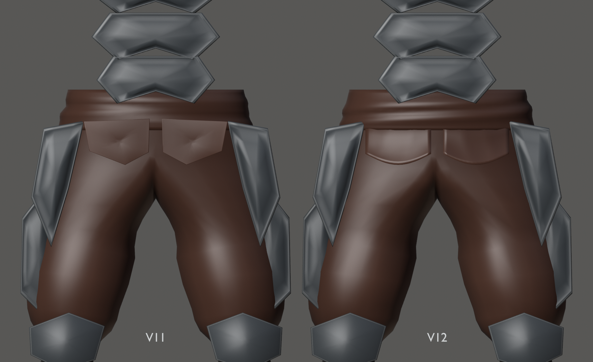
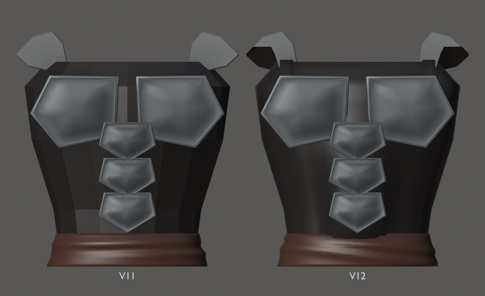

# Hound v12 — H04, ropa y ensamblaje

20 de septiembre de 2026 · Hito 94. Entrada v11 (`de11e03`), conservada.
H04 terminada como propuesta para H05; **no constituye aprobación de escultura**.

Pliegues amplios del pantalón, faja con pliegues diagonales y paños con pared
de 3 mm, raíz oculta bajo la faja y borde libre adaptado a la flexión.
El chaleco continuo sostiene las láminas abdominales y dorsales; dos apoyos
mediales unen pecho, bases claviculares y espalda sin cubrir los deltoides.
Doce placas del torso conservan sus caras exteriores y tienen retornos de 4 mm.

Se recorta únicamente el asiento de seis piezas claviculares que entraban
en los brazos. Las puntas expuestas se conservan. Capucha y abertura, cuello,
rostro, brazos, manos y armadura de piernas permanecen exactos.
Ocho componentes reconstruidos, quince ajustados, dos añadidos y **73 exactos**.

## Vistas y poses

- Conjunto: [frente](front.png), [perfil](profile.png), [espalda](back.png), [tres cuartos](rest.png).
- Detalles: [cintura](waist.png), [entrepierna](crotch.png), [axila](axilla.png),
  [cuello](neck.png) y [soporte posterior](back-assembly.png).
- Torso: [giro izquierdo](pose-twist-left.png), [derecho](pose-twist-right.png),
  [detalle posterior en giro](pose-twist-back.png) y [alcance](pose-reach.png).
- Piernas: [paso izquierdo](pose-step-left.png), [derecho](pose-step-right.png),
  [flexión izquierda](pose-hip-left.png), [derecha](pose-hip-right.png)
  y [paño durante la flexión](pose-hip-detail.png).
- Cabeza: [izquierda](pose-head-left.png) y [derecha](pose-head-right.png).
- [Vídeo diagnóstico](assembly-check.mp4): 361 frames, 1000×1000, 30 fps, 12,033 s.

El vídeo cambia de cámara para mostrar espalda, piernas, cintura y cuello.
Son poses FK de revisión, sin apoyo de pies ni locomoción final.
Las comparativas aíslan los componentes de la zona; las vistas generales muestran
el modelo completo. Todo procede de la geometría real, sin paintover.

## Fuente y comprobaciones

- [Fuente Blender](../../../../art/characters/hound/v12/hound-mesh-v12.blend).
- [glTF](../../../../assets/characters/hound_rig/v12/hound-rig.gltf) y [BIN](../../../../assets/characters/hound_rig/v12/hound-rig.bin).
- [Informe: contactos, límites y reproducción](../../../../reports/hound-cloth-94/README.md).

Escena `Hound_Mesh_v12`, malla `H12_DeformMesh`, rig `Hound12_Rig`,
acción `Hound12_joint_check`, colección `HOUND_v12_EXPORT`.
36.466 vértices, 72.568 triángulos (+2,75 %), 98 componentes, 87 rígidos,
siete materiales, un mesh/skin y los mismos 53 huesos. Máximo dos influencias.

Fuente reabierta: geometría/pesos, conservación, 61 muestras del clip,
37 poses y 444 pares locales por pose comprobados. Sin cruces en los bordes
libres de los paños contra el pantalón, ni entre brazos y asientos claviculares.
Hay solapes constructivos ocultos, enumerados en el informe; no es una
certificación de colisión global ni de todos los movimientos posibles.

Roundtrip en 13 poses: error máximo 0,000002069 m; regresión v11 pasa.
Cooker/visor Vulkan estático: 7/7 piezas, siete batches. CTest: 3/3.
22 PNG y fotogramas clave del vídeo inspeccionados; vídeo completo decodificado.

H05 queda pendiente y **no iniciada**. No hay simulación de tela, rig nuevo,
UVs/texturas finales, agarres de producción ni sustitución del Hound jugable.
