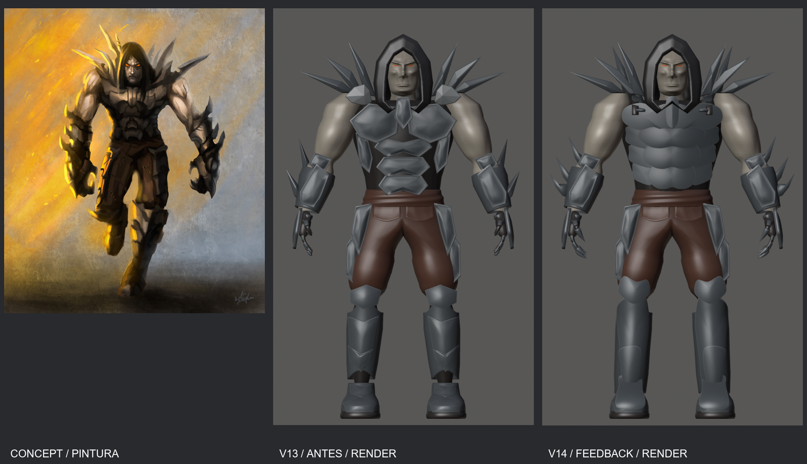
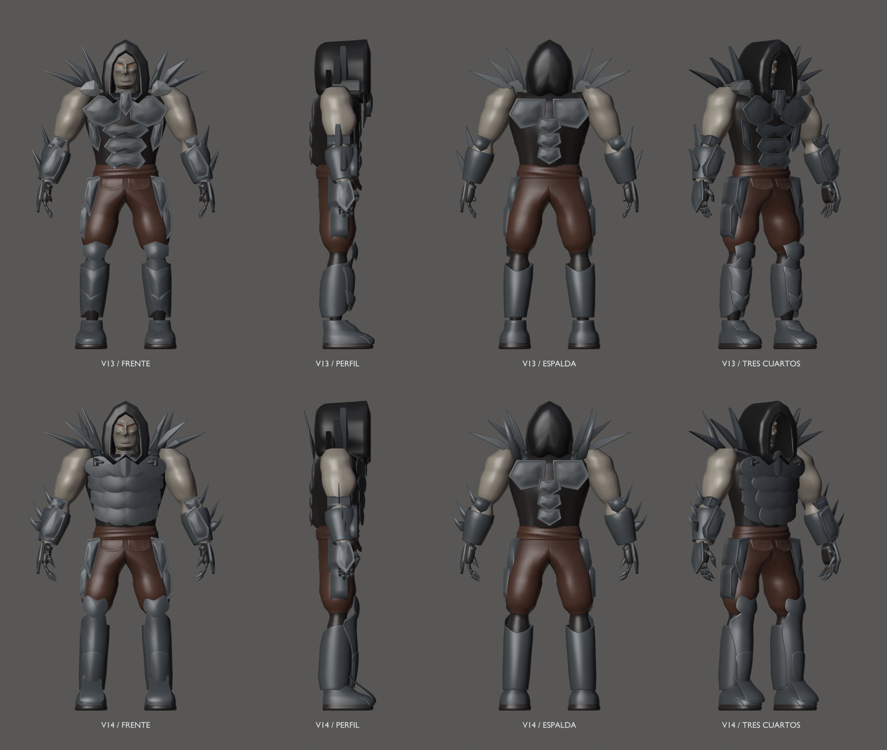
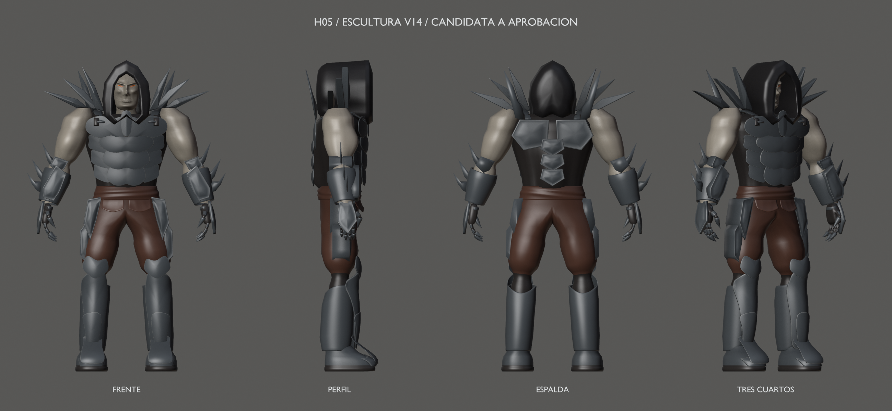
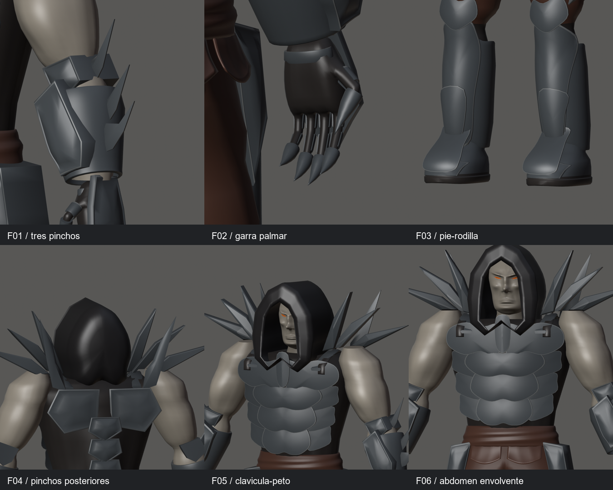
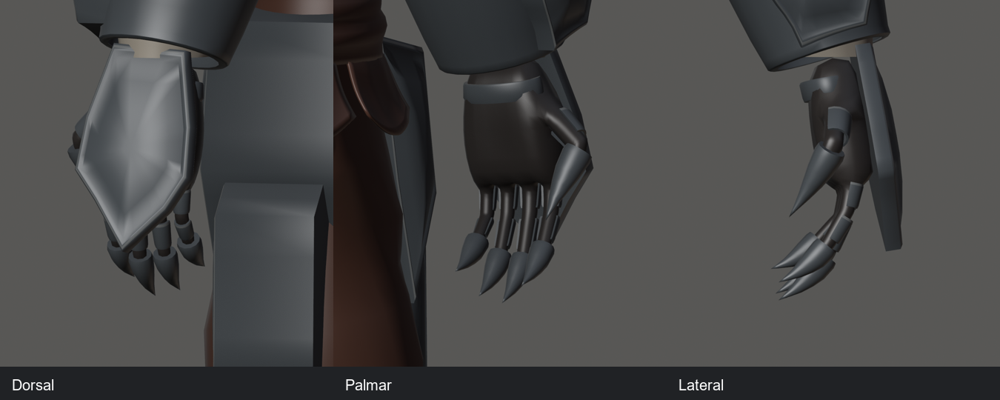
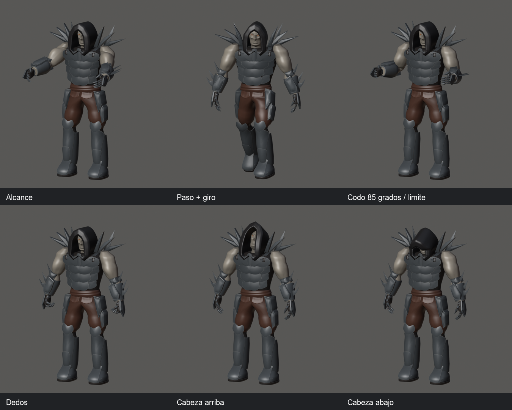
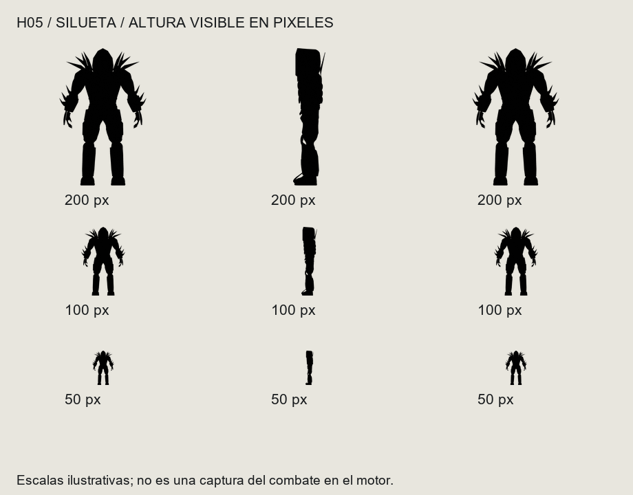
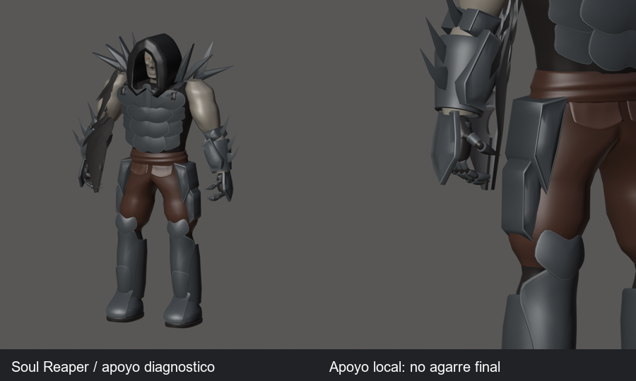

# Hound v14 — feedback H05 aplicado

> Galería histórica del hito 97. La [candidata vigente v15](../mesh-v15/README.md)
> conserva las formas centrales F01–F06, ajusta la capucha (hito 98) y amplía la cobertura de armadura (hito 99).
> H05 sigue pendiente de aceptación visual explícita.

21 de septiembre de 2026 · Hito 97. **Candidata en revisión; falta aceptación artística explícita.**
H06 no se ha iniciado. V13 y las referencias anteriores permanecen intactas.

[Fuente Blender](../../../../art/characters/hound/v14/hound-mesh-v14.blend) ·
[glTF](../../../../assets/characters/hound_rig/v14/hound-rig.gltf) ·
[BIN](../../../../assets/characters/hound_rig/v14/hound-rig.bin) ·
[Manifiesto SHA-256](../../../../art/characters/hound/v14/sculpture-reference.json) ·
[Informe técnico](../../../../reports/hound-feedback-97/README.md)

Escena `Hound_Mesh_v14`, malla `H14_DeformMesh`, rig `Hound14_Rig`,
acción `Hound14_joint_check`, colección `HOUND_v14_EXPORT`.

## Los seis cambios

- F01: tres filos separados por antebrazo, con tamaños escalonados y raíz sobre el guantelete.
- F02: cinco dedos por mano conservados; diez terminaciones acorazadas curvadas y puntiagudas,
  visibles en reposo. Pulgar oponible y placa dorsal completa en pico conservados.
- F03: greba prolongada sobre la bota, empeine y espinilla continuos; remate elevado sobre rodilla.
  Las placas siguen articuladas; la continuidad de aspecto no suelda tobillo y pantorrilla.
- F04: una lámina posterior ascendente por lado, dos nuevas en total, ancladas a la espalda.
- F05: asiento clavicular más bajo y medial, filo central desde clavícula y peto más achatado.
- F06: láminas abdominales curvas de anchuras/alturas distintas, con entrantes centrales,
  solapes y continuación hacia los flancos.

## Concept y evolución

La pintura es una referencia; las otras dos columnas son renders de geometría real.
V13 y v14 comparten cámara, escala e iluminación. No hay retoque del modelo en 2D.

## Detalles del feedback

[Abdomen y peto a tamaño completo](torso.png) · [Clavículas](collar.png) ·
[Tres pinchos](bracer-side.png) · [Piernas](boots.png) · [Filos posteriores](rear-blades.png)

## Poses, vídeo y silueta

[Vídeo real, 331 frames a 30 fps](global-check.mp4) · [Fotogramas de revisión](video-keyframes.png)

Las escalas son ilustrativas, no una captura del combate integrado.

## Arma y límites pendientes

El apoyo heredado de H01 sigue siendo **inválido**: atraviesa brazo y guantelete.
Las puntas nuevas también alcanzan la carcasa. H08 debe resolver el agarre y el socket;
esta pose no aprueba ninguno. No se modifica el arma.

Persisten el pinzamiento de codos a 85°, cabeza/torso al mirar abajo y cruces
constructivos entre retornos de placas, forro y guantes. El abdomen articulado
tiene contactos al girar el tronco que requieren resolver holguras/pesos de producción.
[Inventario completo](../../../../reports/hound-feedback-97/contacts.md) y
[cambios frente a v13](../../../../reports/hound-feedback-97/contact-changes.md).
Sin cruces entre brazos y asientos claviculares/flancos, entre filos posteriores
y capucha, ni entre tercer pincho y placa de mano en las muestras revisadas.
La raíz del pincho sí se inserta bajo la carcasa y alcanza la superficie interior
del antebrazo: es un solape oculto registrado, no una holgura certificada.

38.162 vértices / 75.928 triángulos, 106 componentes; 62 ajenos exactos.
Mismos 53 huesos y claves diagnósticas. Topología, pesos, 61 muestras y roundtrip
en 13 poses pasan; error máximo 0,000002069 m. Auditoría global de 33 poses.
Cooker/visor estático y CTest 3/3 pasan. [Captura del visor](gloom-preview.png).

Commit local del hito 97; resolver con `git log --oneline --grep='^hito 97:'`.
La entrega aplica el feedback; no registra aprobación de H05 ni inicia H06.
