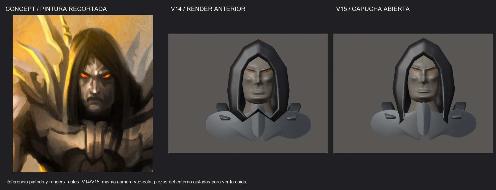
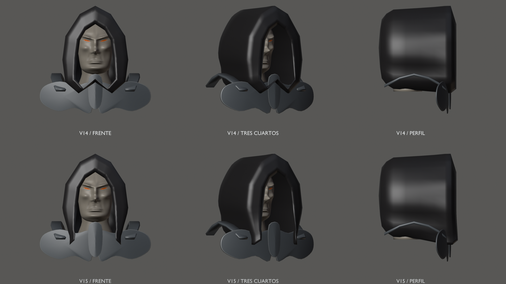
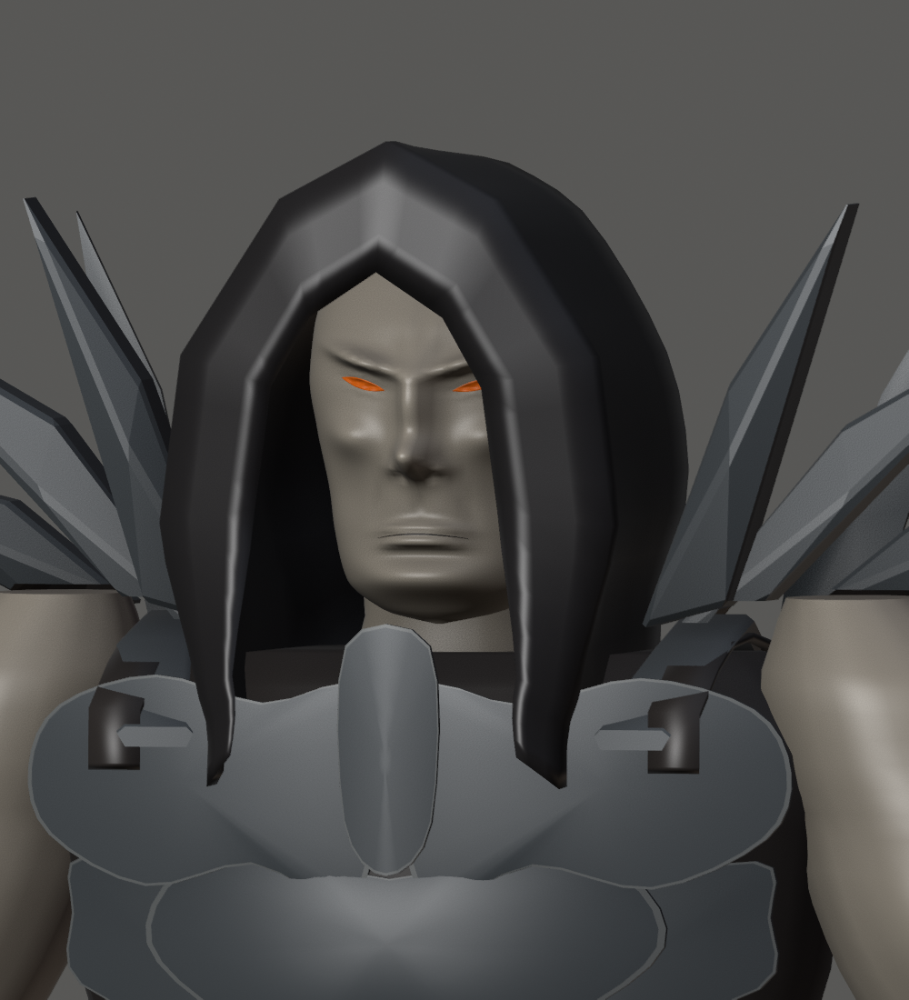
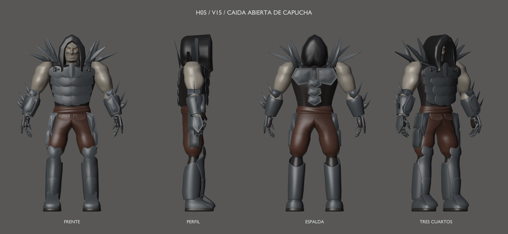
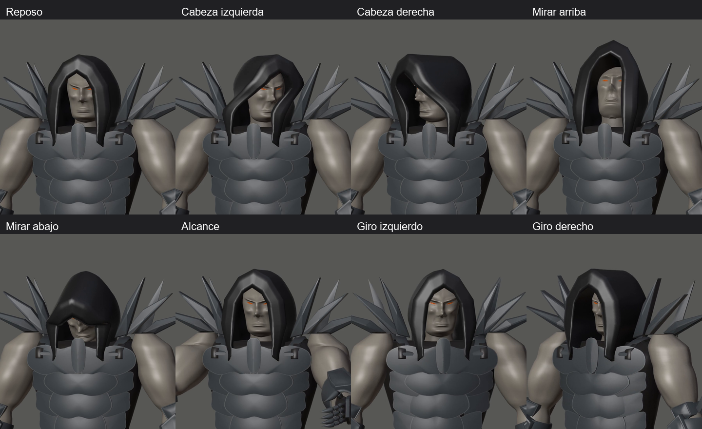

# Hound v15 — caída de capucha, H05 en revisión

22 de septiembre de 2026 · Hito 98 · **Pendiente de aceptación visual explícita**.

Dos extremos caen junto al cuello sobre el pecho, siguiendo la lectura del concept.
Se elimina la unión frontal en W, conservando la cobertura de la nuca y el marco
superior del rostro. Las otras 105 piezas, huesos y poses son exactas respecto a v14.

La referencia es una pintura recortada; las dos vistas 3D son renders reales a
igual cámara y escala, con piezas del entorno aisladas para ver el borde inferior.

## Resultado completo

[Frente](hood-front.png) · [Perfil](hood-profile.png) · [Espalda/nuca](hood-back.png) ·
[Cuerpo completo](full.png).

## Movimiento diagnóstico

[Vídeo de capucha, cuello y torso](hood-check.mp4) — 7,033 s, 211 frames, 30 fps.

[Giro izquierdo](head-left.png) · [Giro derecho](head-right.png) ·
[Mirar arriba](look-up.png) · [Mirar abajo](look-down.png) ·
[Alcance](reach.png) · [Torsión](twist-left.png).

La capucha no presenta autointersecciones ni nuevos contactos con piezas que
estuvieran libres en v14 en las 33 poses revisadas. Conserva inserciones ocultas
en cuello, torso y peto; al bajar la cabeza el rig provisional dobla la tela
con fuerza. No es una simulación ni un rig definitivo.
Los límites anteriores de codo, torso, láminas y agarre siguen registrados.

## Fuente y comprobaciones

[Blender v15](../../../../art/characters/hound/v15/hound-mesh-v15.blend) ·
[glTF](../../../../assets/characters/hound_rig/v15/hound-rig.gltf) ·
[BIN](../../../../assets/characters/hound_rig/v15/hound-rig.bin) ·
[Manifiesto](../../../../art/characters/hound/v15/sculpture-reference.json) ·
[Informe 98](../../../../reports/hound-hood-98/README.md) ·
[Contactos](../../../../reports/hound-hood-98/contacts.md).

Escena `Hound_Mesh_v15`, malla `H15_DeformMesh`, rig `Hound15_Rig`,
acción `Hound15_joint_check`, colección `HOUND_v15_EXPORT`.
38.085 vértices / 75.774 triángulos; cifras de autoría, sin presupuesto H06.
Fuente reabierta, topología/pesos, 61 muestras, 33 poses, roundtrip en 13 poses,
regresión v14, cooker/visor estático y CTest 3/3 pasan.
[Captura de carga en el motor](gloom-preview.png); no prueba animación jugable.

[Feedback F01–F06 conservado en v14](../mesh-v14/README.md).
V13/v14 intactas. Commit local del hito 98; resolver con git log.
H05 sigue en revisión; H06 no se ha iniciado. Sin push.
