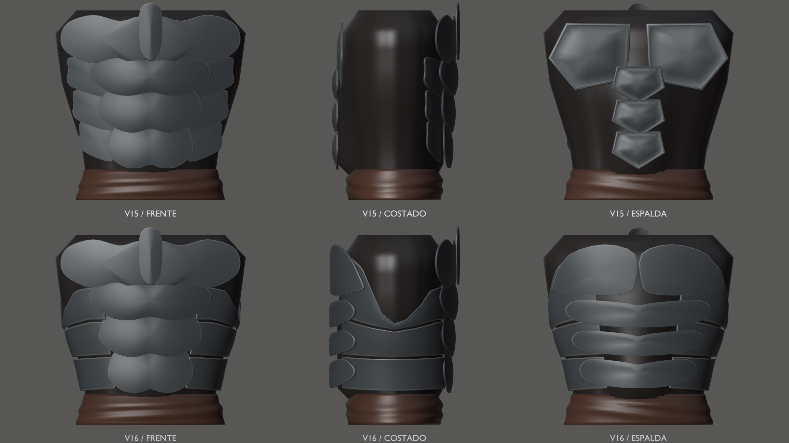
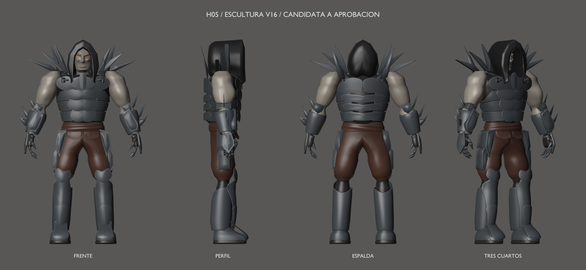
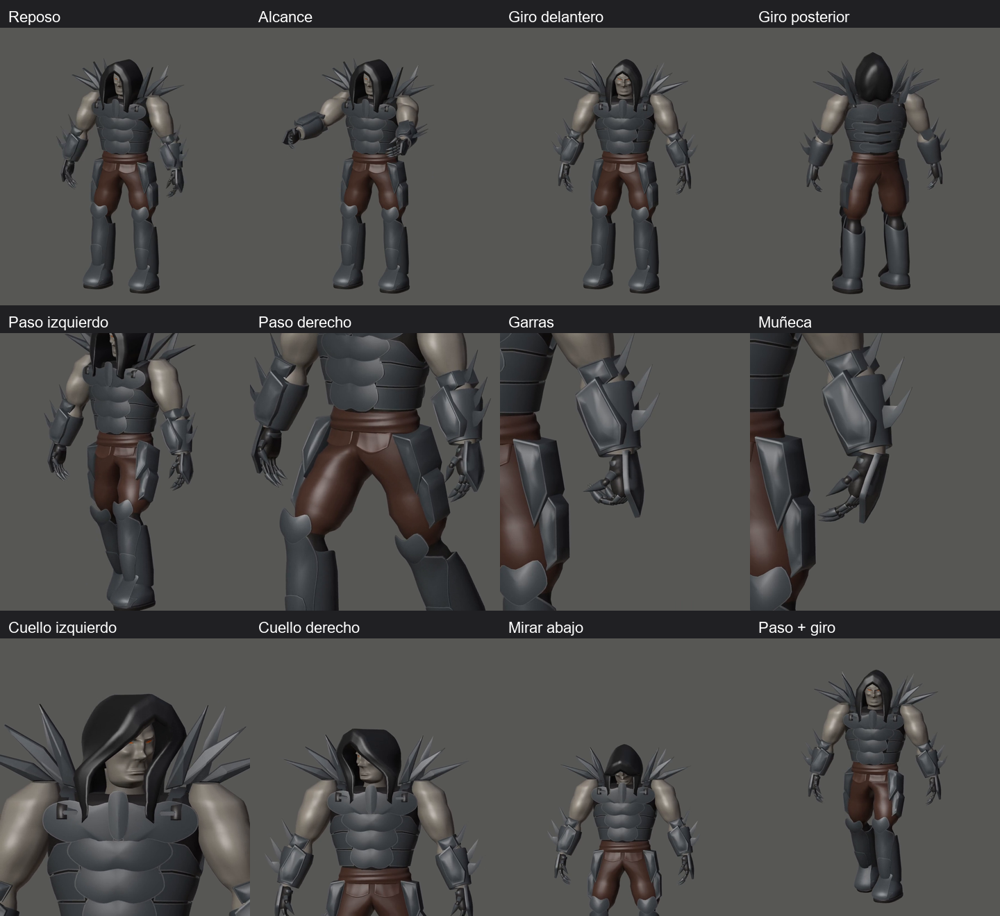
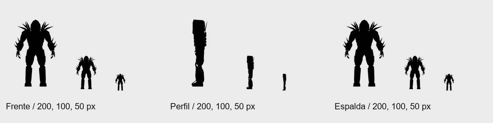

# Hound v16 — armadura envolvente, H05 en revisión

22 de septiembre de 2026 · Hito 99 · **Pendiente de aceptación visual**.

La coraza cubre ahora la espalda con placas más amplias y rodea los costados
con bandas articuladas. La malla interior queda visible en las axilas,
separaciones y cintura. Se conservan la caída de capucha aceptada, el peto,
los abdominales centrales, las garras y las carcasas de antebrazos y grebas.

Renders reales a igual cámara y escala. Esta lámina aísla el torso para que
los brazos y la capucha no oculten los costados; las vistas siguientes muestran
el personaje completo.

[Antes y después completos](before-after.png) · [Frente](armor-front.png) ·
[Costado](armor-side.png) · [Espalda](armor-back.png) ·
[Tres cuartos posteriores](armor-rear-quarter.png).

## Movimiento y lectura a distancia

[Vídeo diagnóstico](global-check.mp4) — 11,033 s, 331 frames, 30 fps.

[Alcance](pose-reach.png) · [Paso y giro](pose-combined.png) ·
[Apoyo diagnóstico de arma](weapon-full.png).
El apoyo de arma sigue pendiente de corrección; no es agarre aprobado.

## Fuente y comprobaciones

[Blender](../../../../art/characters/hound/v16/hound-mesh-v16.blend) ·
[glTF](../../../../assets/characters/hound_rig/v16/hound-rig.gltf) ·
[BIN](../../../../assets/characters/hound_rig/v16/hound-rig.bin) ·
[Manifiesto](../../../../art/characters/hound/v16/sculpture-reference.json) ·
[Informe 99](../../../../reports/hound-armor-99/README.md) ·
[Contactos](../../../../reports/hound-armor-99/contacts.md).

Escena `Hound_Mesh_v16`, malla `H16_DeformMesh`, rig `Hound16_Rig`,
acción `Hound16_joint_check`, colección `HOUND_v16_EXPORT`.

11 placas reconstruidas; 95 componentes ajenos exactos. Huesos, bind pose y
claves conservados. La nueva placa lumbar central comparte el peso provisional
de su banda lateral para evitar cruzarla al girar.
40.274 vértices / 80.152 triángulos; malla de autoría, sin presupuesto H06.

Topología/pesos, 61 muestras, 33 poses globales, roundtrip, regresiones v15,
cooker/visor estático y CTest 3/3 pasan. No hay autointersecciones nuevas ni
cruces de las once placas con brazos, cabeza, cuello, capucha o manos en esas poses.
Persisten inserciones entre placas, límites heredados de codos/torso y el agarre;
se describen en el informe. [Captura del visor](gloom-preview.png).

[Capucha v15 conservada](../mesh-v15/README.md).
Commit local del hito 99; resolver con git log.
H05 sigue en revisión; H06 no se ha iniciado. Sin push.
