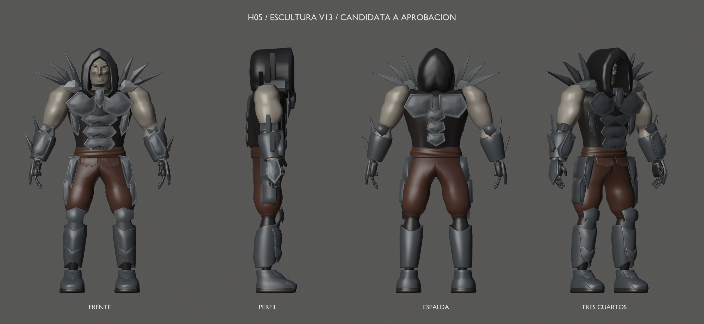
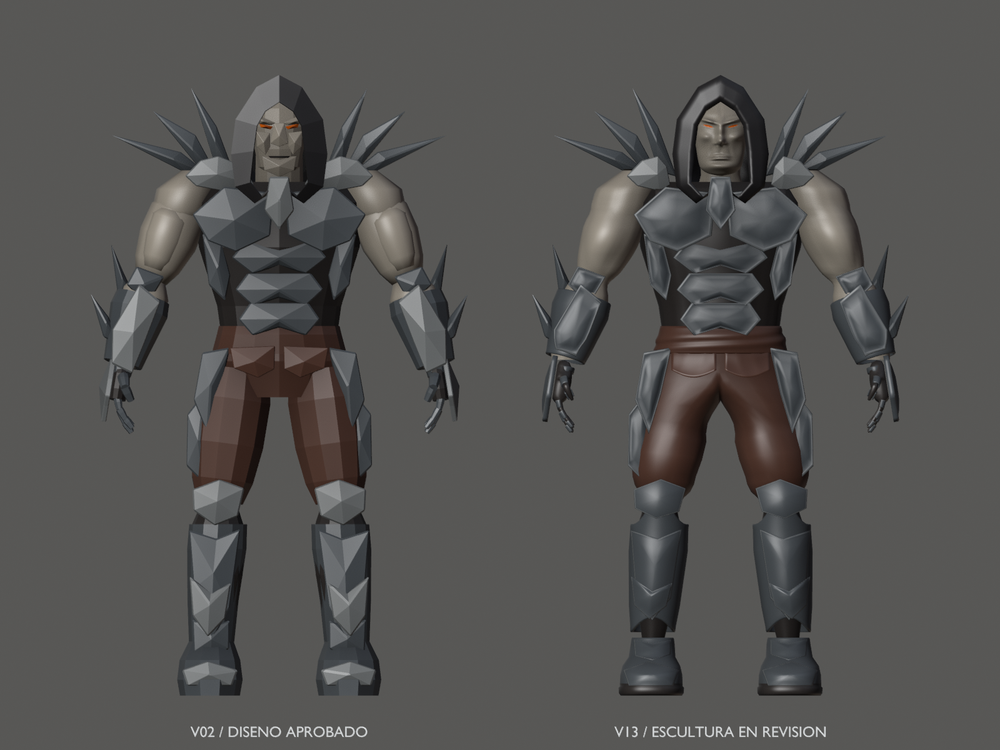
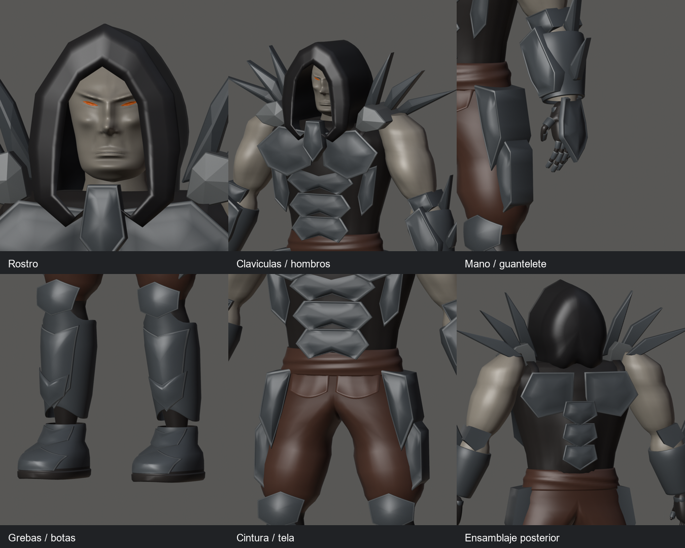
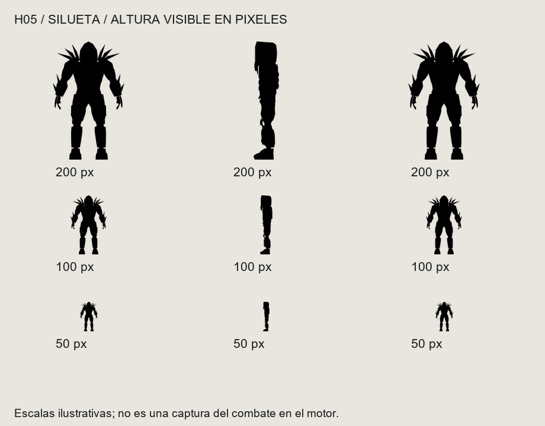
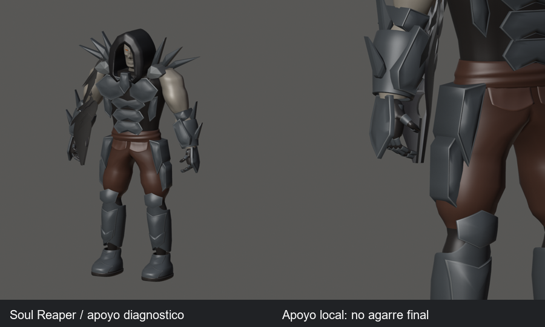

# Hound — H05, revisión global de escultura

**Revisión histórica v13.** El feedback posterior se aplica en [v14 / hito 97](../mesh-v14/README.md), candidata vigente aún sin aceptación.

20 de septiembre de 2026 · Subhito 95 · **En revisión; falta aceptación explícita del usuario.**
Candidata v13: copia exacta de v12/H04, conservada como referencia inmutable.
No se ha cambiado la geometría ni se ha aprobado el cierre artístico.

**Actualización del 21 de septiembre:** el usuario pidió seis correcciones.
[Feedback F01–F06 preparado para modelar](../tasks/H05-feedback-2026-09-21.md).
Esta galería conserva la propuesta anterior v13; las modificaciones aún no se han aplicado.

## Comparación y decisión artística

Se revisaron el [concept original](../../characters/hound-original-concept.jpg),
el [boceto 01](../hound-concept-v01.png) y el diseño 3D v02 aprobado.
Se conservan hombros libres, filos claviculares, capucha adelantada, piel ceniza,
ojos pequeños y placa dorsal de mano completa en pico.

La candidata tiene superficies continuas y más suaves que v02. La jerarquía
sigue siendo capucha/clavículas, torso y masas de brazos, guanteletes y piernas.
Perfil y espalda mantienen la construcción de la versión aprobada.
La capucha conserva un perfil bastante rectilíneo; no se ha rediseñado.
El rostro y la tela son más limpios y regulares que el concept pintado:
esta diferencia de acabado queda visible para la decisión del usuario.
No se añaden microdetalle ni remates de geometría sin una necesidad demostrada.

Detalles completos: [cara](face.png), [clavículas](collar.png), [manos](hands.png),
[botas](boots.png), [cintura](waist.png), [ensamblaje posterior](back-assembly.png).

## Lectura a distancia y movimiento

Las masas y las puntas se reconocen de frente/espalda a 100–200 px;
a 50 px desaparece el detalle interno. El perfil es mucho más estrecho y los
filos se superponen. Son escalas ilustrativas de lectura, no distancias
calibradas ni capturas de combate del motor.

- [Vídeo diagnóstico global](global-check.mp4): 331 frames, 900×1000, 30 fps, 11,033 s.
- [Fotogramas clave](video-keyframes.png): alcance, torso, piernas, dedos, muñeca,
  cabeza y una combinación de paso/giro. Son poses FK, sin apoyo de pies.
- [Lámina de poses](poses.png): incluye los límites de codo y cabeza.
- [Fuente, validación y reproducción](../../../../reports/hound-review-95/README.md).
- [Inventario completo de contactos medidos](../../../../reports/hound-review-95/contacts.md).

## Límites que la aceptación de formas no resolvería

El apoyo local de H01 queda libre de cruces en guante/dedos, pero falla al
comprobar **todo el cuerpo**: el arma entra en brazo, guantelete y, en reposo,
clavícula derecha. No es un socket ni una empuñadura de producción.
La pose y el arma solo existen durante la revisión; no se exportan.

El [codo a 85°](limit-elbow.png) conserva pinzamiento del brazo.
Al [mirar abajo](limit-neck.png), cuello +10° y cabeza +20°, la cabeza cruza el
soporte del torso y la capucha se pliega de forma poco natural.
También hay ensamblajes de superficies solapadas bajo placas, guantes,
capucha y cintura. Las falanges penetran el guante en sus inserciones.
Estos puntos deben resolverse en la malla/rig de producción antes de UVs
o animaciones finales; no son una certificación de rig ni de colisiones.
No se garantiza que basten cambios de pesos: podrían requerir ajustes locales
de topología o encaje, conservando las formas que llegue a aprobar el usuario.

## Referencia maestra candidata

- [Blender v13](../../../../art/characters/hound/v13/hound-sculpture-v13.blend).
- [Exportación glTF](../../../../assets/characters/hound_rig/v13/hound-rig.gltf)
  y [BIN](../../../../assets/characters/hound_rig/v13/hound-rig.bin).
- [Manifiesto de integridad SHA-256](../../../../art/characters/hound/v13/sculpture-reference.json).
- Entrada conservada: [Blender v12](../../../../art/characters/hound/v12/hound-mesh-v12.blend).

**Los nombres internos siguen siendo v12**, porque la copia es idéntica byte a byte:
escena `Hound_Mesh_v12`, malla `H12_DeformMesh`, rig `Hound12_Rig`,
acción `Hound12_joint_check`, colección `HOUND_v12_EXPORT`.
36.466 vértices / 72.568 triángulos, 98 componentes, siete materiales,
53 huesos diagnósticos y máximo dos influencias; no es un presupuesto final.

Fuente reabierta: 98 superficies conexas/cerradas/orientadas, pesos normalizados.
33 poses / 156.849 pares de componentes evaluados, con incidencias documentadas.
Roundtrip en 13 poses: máximo 0,000002069 m; regresión v12 pasa.
Cooker/visor estático Vulkan 7/7; CTest acotado 3/3.
26 PNG y fotogramas clave inspeccionados; vídeo completo decodificado.

V13 continúa sin aprobación. El siguiente pase debe atender F01–F06 y presentar
una candidata nueva para aceptación explícita de sus formas. H05 no está hecha
ni habilita H07; este feedback no es una aprobación del modelo actual.
H06 y las siguientes tareas no se han iniciado.
