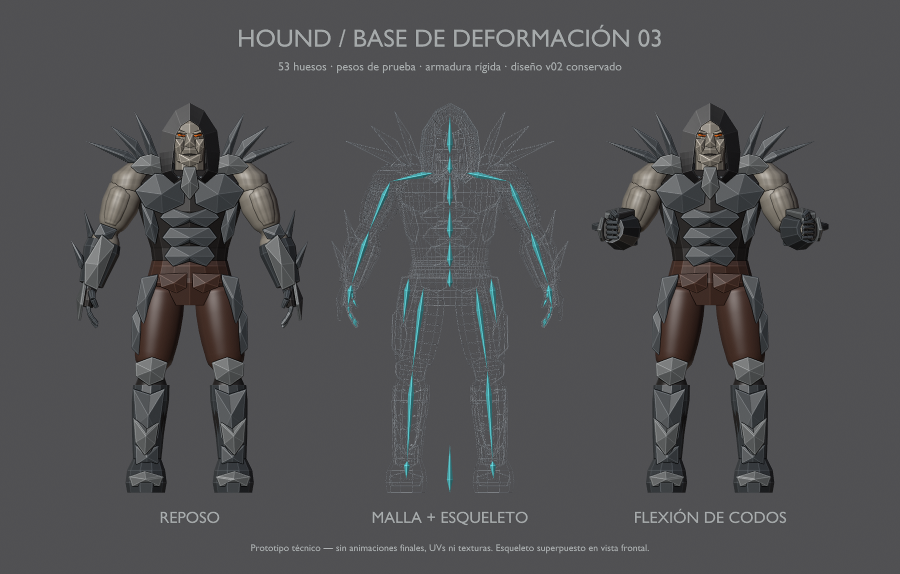

# Hound v03 — prototipo de malla y esqueleto

10 de septiembre de 2026 · Hito 83. Base técnica, no malla ni rig definitivos.
El diseño aprobado sigue siendo [v02](../blockout-v02/README.md).

- [Fuente Blender](../../../../art/characters/hound/v03/hound-rig-v03.blend).
- [Vídeo de articulaciones](joint-check.mp4): 181 imágenes a 30 fps; no es caminar ni Bite.
- [Reposo](rest.png), [frente](front.png), [codos](elbows.png), [alcance](reach.png) y [pierna](step.png).
- [glTF con skin y clip diagnóstico](../../../../assets/characters/hound_rig/v03/hound-rig.gltf), junto a su BIN.

Una malla, 8.781 vértices de autoría, 17.130 triángulos, siete materiales,
53 huesos y hasta dos influencias por vértice. Hay cuatro extremidades continuas
con 23 anillos y 93 componentes rígidos. Los grupos `PART_` permiten seleccionar
las piezas originales dentro de la malla agrupada.

El esqueleto retiene los 43 nombres del rig de Archangel, pero ajusta centros,
longitudes, ejes y jerarquía al Hound. Añade ocho falanges distales y dos controles
de placas de cadera. Los clips originales NO son directamente compatibles: aún
requieren adaptación. Control FK mediante colecciones Body/Arms/Legs/Fingers/Armor.

La escena activa es `Hound_Rig_v03`; el archivo conserva escenas de referencia.
Solo la malla y el rig v03 se exportan. El clip `Hound03_joint_check` dura 6 s,
comienza en cero y usa LINEAR/STEP. En Blender: fotogramas 1, 31, 61, 91, 121,
151 y 181; marcadores de reposo, codos, alcance, pierna, torso y dedos.

## Alcance y siguiente pase

El rig sirve para detectar problemas antes de afinar la malla. El usuario
confirma que primero debe estabilizarse la topología y después pulir pesos,
controles y animaciones. No es necesario terminar las texturas para hacerlo.

Quedan uniones visibles entre deltoides, bíceps y brazo, contactos de placas,
anatomía/facciones provisionales y agarres sin comprobar. El siguiente pase
trabaja la malla manteniendo este rig como herramienta de diagnóstico.
Sin UVs/texturas finales, locomoción/Bite finales ni sustitución del personaje.

La lámina usa geometría real; el esqueleto central es una superposición frontal
de las coordenadas X/Z de sus huesos. El visor Gloom prueba carga y reposo,
no reproducción de este clip. Validaciones: [informe 83](../../../../reports/hound-rig-83/README.md).
